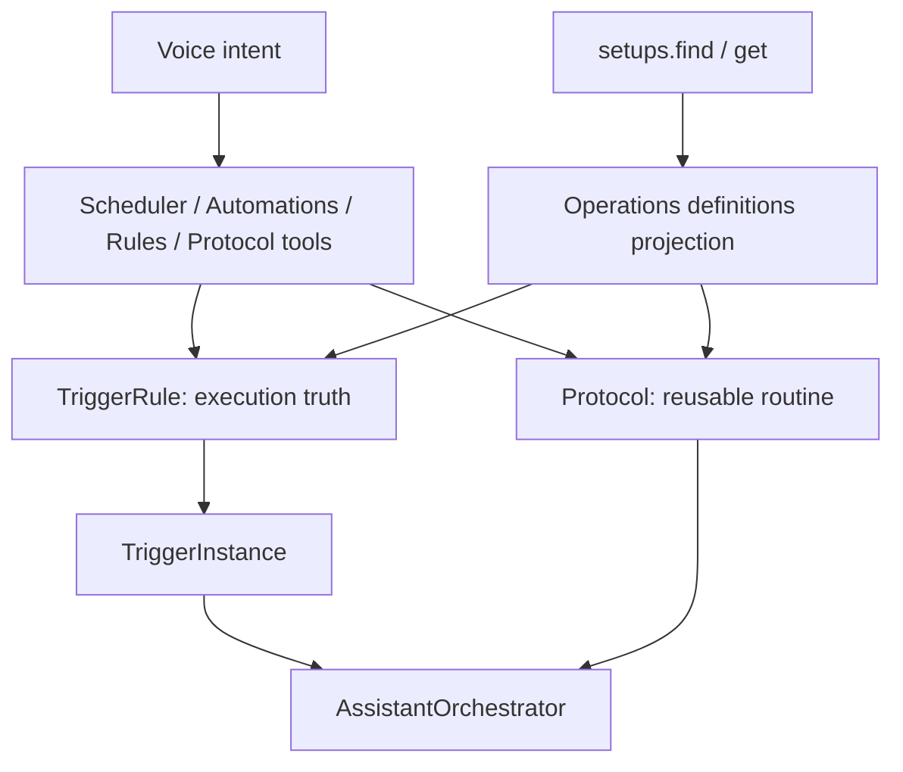

# Automation Primitive

**Status:** Superseded by the provider-composed setup control plane  
**Date:** 2026-05-09  
**Updated:** 2026-06-19

## Decision

Do **not** add a `Behavior` entity, collection, plugin, or execution path.

JARV1S already has the durable execution primitive: `TriggerRule`. A rule holds the user-authored intent for proactive work: `name`, `enabled`, `origin`, `conditions`, `action`, `attention`, `delivery`, `paused_until`, exceptions, and suppression state. When a rule invokes a protocol, the authored intent is the rule plus the reusable `Protocol`; `TriggerInstance` rows are runtime history, not a separate source of truth.

The user-facing need is still real, but it is solved as the Operations "what you've set up" surface:

- `TriggerRule.surface` controls whether a rule appears in default user-facing definition lists.
- `TriggerRule.description` is optional helper copy for surfaced definitions.
- `core.operations.projection.find_managed_setups()` composes source-owned setup views at read time.
- `setups.find/get()` answer "what have you set up?" across domains.
- `activity.why_last_fire()` explains trigger history without owning configuration management.

## Model



There is no stored wrapper. The projection reads from source records and never mirrors `attention`, `delivery`, conditions, actions, or protocol steps.

## Data Shape

Additive fields on the source record:

```python
class TriggerRule(BaseModel):
    # existing fields...
    description: str | None = None
    surface: bool = True
```

Backfill policy:

- Existing rules default to `surface=True`.
- Habit check-ins and system/internal rules default to `surface=False`.
- New creation paths set the flag at the source. User-authored scheduler, automation, and rules-plugin creations surface by default; habit check-in series opt out.

## Tool Surface

The inventory surface is consolidated under `setups`:

- `setups.find(query=None, status=None, setup_type=None)` is the umbrella inventory.
- `setups.get(target)` resolves one stable reference or natural query.
- `setups.pause/resume/delete` delegate only uniform lifecycle operations.
- `activity.why_last_fire(name_or_id)` remains the latest-fire explanation path.

Old inventory tools are intentionally not LLM-facing:

- `automations.list_rules` was removed from the tool surface. Use `setups.find(setup_type="automation")`.
- `protocol.list_protocols` was removed from the tool surface. Use `setups.find(setup_type="protocol")`.
- `scheduler.get_alerts` remains separate because it is occurrence-level: pending/imminent timers, alarms, reminders, countdowns, and `instance_id` / `series_id` values for edit/snooze/skip/cancel flows.

## Runtime Boundaries

Trigger action kinds stay small:

- `notify`: deliver static user-facing text.
- `run_protocol`: run a named, reusable protocol.
- `evaluate`: run a one-off directive through the normal Jarvis turn path.

`dispatch_agent` is reserved but unimplemented as a trigger action. Use `jarvis.agents.dispatch(mode="jarvis")` for delegated background work instead of creating a second trigger execution path.

## Non-Goals

- No `behaviors` collection.
- No `backend/core/behaviors` package.
- No new `behaviors` plugin or REST route.
- No ReactFlow-style node graph.
- No YAML workflow import/export.
- No LLM reasoning inside hot-path condition evaluation.
- No replacement of `TriggerRule`, `TriggerInstance`, or `Protocol`.
- No generalized workflow engine unless flat protocols fail on concrete real use cases.

## Acceptance Criteria

- JARV1S can answer "what have you set up?" through `setups.find`.
- JARV1S can answer "why did that fire?" through `activity.why_last_fire`.
- Trigger execution still uses existing trigger, automation, scheduler, and orchestrator services.
- Protocols remain the complex reusable action primitive.
- Delivery remains compatible with `TriggerAction.decision` (`tell`, `offer`, `act`) and routing-only `DeliveryPlan`.
- The implementation adds no new runtime orchestration path and no mirrored state.
