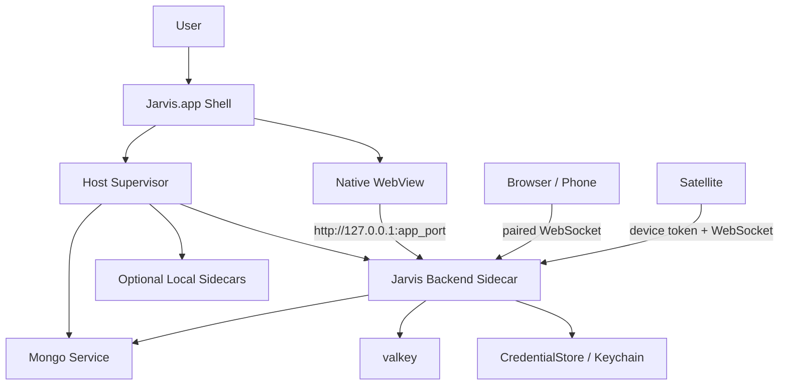

# Jarvis Host App

**Status:** In progress — Phase 0–1b implemented; clean-machine validation and Phase 1a exit (voice, `N-1`→`N` dogfood) pending  
**Date:** 2026-06-25  
**Updated:** 2026-07-05  
**Normative commands / limits:** `[apps/desktop/README.md](../../apps/desktop/README.md)`  
**Related:** `docs/VISION.md`, `docs/ARCHITECTURE.md`, `docs/UI/FRONTEND_ARCHITECTURE.md`, `docs/SYSTEM_STATES.md`, `docs/SATELLITE.md`, `docs/deployment/JARVIS_HOST_STARTUP_CONTRACT.md`, `docs/deployment/VERSIONING_AND_DEPENDENCIES.md`, `docs/research/ONBOARDING_FRICTION_LOG.md`

Phase 1b (bundled native `mongod`) is implemented. This proposal stays here until clean-machine validation completes and Phase 1a exit criteria are met. Do not move to `proposals/partial/` or `proposals/built/` before that.

---


## Implementation Status (2026-07-05)

Code lives under `[apps/desktop/](../../apps/desktop/)`. Task entry points: `task desktop:dev`, `task desktop:build`, `task desktop:dogfood` (alias for `desktop:push`), `task desktop:doctor`, `task desktop:release` (`[Taskfile.yml](../../Taskfile.yml)`). Release CI: `[.github/workflows/desktop-release.yml](../../.github/workflows/desktop-release.yml)` on `v*` tags.


| Area                                              | State | Notes                                                                                                                           |
| ------------------------------------------------- | ----- | ------------------------------------------------------------------------------------------------------------------------------- |
| Tauri 2 shell + native startup WebView            | ✅     | `apps/desktop/shell-src/`; navigates to backend origin on ready                                                                 |
| Host supervisor + startup phases                  | ✅     | `supervisor.rs` mirrors `[JARVIS_HOST_STARTUP_CONTRACT.md](../deployment/JARVIS_HOST_STARTUP_CONTRACT.md)`                      |
| `HostLaunchState` / Tauri commands                | ✅     | `get_launch_state`, `start_host`, `restart_host`, `stop_host`                                                                   |
| Backend process-group cleanup                     | ✅     | `kill_process_tree` on backend stop/exit; Docker containers are **not** stopped                                                 |
| `dev_repo` mode (`task desktop:dev`)              | ✅     | `uv run uvicorn` from repo checkout + Docker Compose                                                                            |
| `packaged_runtime` mode (`task desktop:build`)    | ✅     | uv-managed Python venv from `backend/uv.lock` in app resources                                                                  |
| macOS app data paths                              | ✅     | `~/Library/Application Support/JARV1S`, `~/Library/Logs/JARV1S` (packaged mode)                                                 |
| Bundled frontend + `JARVIS_APP_MODE=1` backend    | ✅     | `build-host-runtime.sh`; backend serves React from bundle                                                                       |
| Signing / notarization / staple pipeline          | ✅     | `release-macos.sh`, `sign-nested-binaries.sh` (runtime + service Mach-O)                                                        |
| Static updater artifacts + manifest               | ✅     | `generate-update-manifest.mjs`, `updater.pub`; `createUpdaterArtifacts: false` in dev builds                                    |
| Launch-time auto-update                           | 🔄    | Opt-in only: `JARVIS_ENABLE_AUTO_UPDATE=1`; downloads and restarts on success                                                   |
| Diagnostics export                                | 🔄    | `export_diagnostics_bundle` Tauri command; metadata-first; user content opt-in; hidden behind developer mode in the React shell |
| Startup recovery UI                               | ✅     | Native shell shows phase checklist; **Try again** + **Open logs** on failure (`open_logs_folder`)                               |
| Docker-backed MongoDB                             | ✅     | Dev default (`dev_repo`) and `JARVIS_SERVICE_PROVIDER=docker` fallback                                                          |
| `ServiceProvider` abstraction                     | ✅     | `Docker` | `Bundled` in `apps/desktop/src-tauri/src/services/`                                                                  |
| Bundled native `mongod`                           | ✅     | Packaged default; Unix socket; `build-service-binaries.sh`                                                                      |
| Release channels beyond `internal`                | ❌     | Phase 2                                                                                                                         |
| Dynamic update endpoint / staged rollout          | ❌     | Phase 2                                                                                                                         |
| In-app diagnostics / update UX in React shell     | 🔄    | Diagnostics menu behind developer mode; export/update progress UI not wired                                                     |
| Menu bar / tray                                   | ❌     | Not built                                                                                                                       |
| `getUserMedia` voice in signed production WebView | ❓     | `Info.plist` + entitlements present; not validated on clean signed builds                                                       |
| Desktop-specific automated tests                  | ❌     | No `apps/desktop` test suite                                                                                                    |
| Windows / Linux shells                            | ❌     | macOS arm64 first                                                                                                               |


**Phase 1a gap vs exit criteria:** resolved for non-technical path via Phase 1b bundled services. Docker remains available for contributor dev and `JARVIS_SERVICE_PROVIDER=docker`.

---


## Problem

Keyless onboarding removed most in-app setup friction for the first text turn, but a normal user still cannot get to the app without developer workflow knowledge. The remaining blocker is distribution:

- There is no download-and-run artifact.
- `task`, `uv`, Node, Python, Docker, local ports, and multi-process orchestration still leak into the product path.
- First-run downloads and service startup are invisible unless the user understands terminal output.
- Hotfixes require pulling source and rerunning commands instead of installing a signed update.
- Version support is split across repository state, backend package version, frontend build output, Docker images, and local data.

The product should feel like a local-first home assistant, not a checked-out development environment.

---


## Decision

Build a **packaged Jarvis Host app** now, starting with macOS direct distribution. Do not build a separate `./jarvis start` bootstrap for users. Keep `task start` for contributors and early validation, but treat the packaged app as the real onboarding surface.

The app is not just a WebView wrapper. It owns:

1. Launching and supervising the local Jarvis Host runtime.
2. Displaying the startup phases from `JARVIS_HOST_STARTUP_CONTRACT.md`.
3. Opening the existing React UI once the backend is reachable.
4. Managing app version, update checks, update download/install, and support metadata.
5. Keeping local services, secrets, and paired clients on the Host side.

Use **Tauri 2 as the first app shell** unless the sidecar packaging spike proves it blocks the core Host requirements. The reason to prefer Tauri first is footprint and a small Rust-native shell, not because Electron cannot supervise child processes. Electron's process and updater ecosystem is mature; it remains the fallback if Tauri's WebView or sidecar lifecycle becomes the bottleneck. The architecture must keep the Host supervisor model portable so another shell can replace Tauri later without changing backend/frontend contracts.

---


## Research Notes


### Apple/macOS Distribution

Apple's direct macOS distribution model requires the developer to manage distribution and updates outside the Mac App Store. Apps distributed outside the Mac App Store should be signed with a Developer ID certificate and notarized so Gatekeeper can verify them.

Relevant Apple requirements:

- Use a **Developer ID Application** certificate for direct distribution.
- Enable **hardened runtime** before notarization.
- Submit the `.app`, `.dmg`, or `.pkg` to Apple's notarization service.
- Staple the notarization ticket so the app can launch cleanly offline.
- Manage software updates yourself when not using the Mac App Store.

This points away from the Mac App Store for V1. JARV1S needs local service supervision, localhost server behavior, microphone access, optional external sidecars, and fast hotfixes. Direct distribution with Developer ID is the right Apple ecosystem starting point.

### Tauri

Tauri supports platform-specific bundles (`.app`, `.dmg`, Windows installers, Linux packages), app versioning via `tauri.conf.json`, code signing/notarization hooks, sidecars through `bundle.externalBin`, and an updater plugin.

Tauri updater implications:

- Update artifacts are signed; signature verification cannot be disabled.
- The public key is embedded in app configuration.
- The private update signing key must be protected; losing it prevents installed clients from receiving future updates.
- Static JSON endpoints are enough for early releases.
- A dynamic update server is needed later for staged rollouts, explicit channels, rollback/downgrade policy, and richer targeting.

Tauri sidecar implications:

- `externalBin` is the documented path for embedding a Python API server or other executable.
- Tauri's normal sidecar handle only owns the immediate child process. PyInstaller `--onefile` commonly creates a bootloader process and a child app process, which can leave orphaned children on shutdown.
- The Host supervisor should spawn long-running sidecars in an OS process group / Windows Job Object equivalent, or otherwise implement process-tree cleanup. "Stop/restart cleans up child processes" is a hard exit criterion, not a polish task.


### Electron

Electron has a more mature desktop distribution ecosystem, especially around `electron-updater`, Squirrel, GitHub Releases, S3-style update hosting, and Windows signing flows. It also requires macOS signing/notarization and Windows signing to avoid OS warnings.

Electron remains a fallback if Tauri sidecar/runtime packaging or WebView behavior becomes the bottleneck. Choosing Electron first would add a much larger app footprint, but it would not avoid the hardest shared work: packaging, signing, notarizing, supervising, and updating the Python backend plus native service processes.

### Python And Native Signing

The highest-risk distribution work is not Tauri versus Electron. It is signing and notarizing a bundle that contains Python, native Python wheels, and service binaries.

macOS notarization requires embedded Mach-O binaries and dynamic libraries to be signed with hardened runtime. Frozen Python apps with native wheels commonly need inside-out signing of every nested binary, then signing the top-level `.app` last. `codesign --deep` is not reliable enough as the only signing strategy for a Python bundle. Some Python/native stacks also require hardened-runtime entitlements such as unsigned executable memory, disabled library validation, or JIT allowance, depending on their loaded libraries.

For JARV1S this is concrete: `onnxruntime`, fastembed/BGE dependencies, audio dependencies, and `mongod` are all native signing surface.

Prefer an app-owned Python runtime built from lockfiles; Phase 1a uses uv-managed Python plus a bundled virtualenv. Avoid PyInstaller `--onefile` for the Host backend because it creates process-tree cleanup problems and tends to make notarization harder. PyInstaller `--onedir`, Nuitka, or another freezer can still be evaluated, but the default plan should preserve real binaries that the supervisor can sign, inspect, and kill predictably.

### MongoDB And Cache Licensing

MongoDB Community Server's SSPL is not the main blocker for a local-first desktop app. MongoDB's own FAQ frames Section 13 around offering MongoDB's functionality to third parties as a service; a single-user desktop app bundling `mongod` for local use is not a public MongoDB-as-a-service offering. The bundling cost is practical: binary size, per-architecture builds, signing/notarization surface, support, and data upgrade discipline.

### Update/Hotfix Best Practice

Desktop apps need an update path from the first public build. For JARV1S, hotfixes are part of onboarding because a broken setup/update path strands users.

Minimum release requirements:

- Signed/notarized app artifacts.
- Signed update artifacts.
- A stable update key and documented key custody.
- SemVer host versioning.
- Release channels (`internal`, `beta`, `stable`) before broad use.
- Diagnostics export containing app version, backend version, startup phase history, process logs, and service versions.
- Staged rollout once there are enough users for a bad release to matter.

Roadmap Phase 10 also matters here: the consolidated voice + agent eval ladder is the trust gate for behavior-changing releases. The app can be built before that gate is complete, and internal self-update can be dogfooded earlier, but external beta auto-update should wait until the unified eval gate exists and runs in release CI.

---


## Product Requirements


### First Launch

The user should:

1. Download `Jarvis.dmg`.
2. Drag/open `Jarvis.app`.
3. See startup progress in a real app window.
4. Land in existing setup if the LLM runtime is not configured.
5. Choose local or cloud LLM.
6. Send the first text turn.

No terminal, GitHub clone, `task`, `uv`, Node, manual Docker step, or `.env` edit should be required for this path.

### Daily Launch

The app should:

- Start the Host if needed.
- Reuse existing local data and credentials.
- Recover from a stale or crashed backend process.
- Show actionable errors instead of raw logs.
- Keep optional lanes non-blocking: voice, smart home, integrations, satellites, search upgrades, background agents.


### Updates

The app should:

- Check for updates on launch and periodically, but not interrupt active voice turns.
- Download updates in the background with visible progress.
- Ask the user to restart when safe.
- Never update dependencies from source on user startup.
- Keep data migrations explicit and separate from dependency updates.


### Support

The app should expose or export:

- App version.
- Backend Host version from `GET /api/v1/version`.
- Frontend build revision.
- Platform and architecture.
- Startup phase history.
- Health/setup state.
- Local service versions.
- Recent app/supervisor/backend logs.

---


## Architecture




The app shell is a process supervisor and native container. The backend remains the Jarvis Host. The frontend remains the existing React app and still talks to the backend through the current REST/WebSocket contracts.

### Boundaries


| Boundary                  | Owner                              | Notes                                                                        |
| ------------------------- | ---------------------------------- | ---------------------------------------------------------------------------- |
| App shell                 | Tauri/Rust                         | Native window, menu/tray, update checks, OS permissions, process supervision |
| Host supervisor           | Rust module, shell-agnostic design | Starts/stops services, records startup phases, exposes status to WebView     |
| Backend                   | Existing FastAPI app               | Owns setup/readiness, turns, plugins, credentials, auth, presence            |
| Frontend                  | Existing React/Vite UI             | Renders setup/chat/status; should not learn process-management details       |
| Satellite/browser clients | Existing WS protocol               | Pair with Host; never receive provider secrets                               |


### Startup State Machine

The app must reuse the startup phases already defined in `JARVIS_HOST_STARTUP_CONTRACT.md`:

1. `check_prerequisites`
2. `prepare_dependencies`
3. `start_services`
4. `start_backend`
5. `wait_for_health`
6. `resolve_setup_state`
7. `ready`

For the packaged app, `prepare_dependencies` should mean "verify bundled runtime assets and local data directories", not `uv sync` or `npm ci`. Normal user startup must not mutate dependency versions.

### WebView Strategy

Use the existing backend-served React app as the primary UI:

- The app window initially shows a small native/static startup view.
- Once the backend health check passes, the WebView navigates to the local backend origin.
- If setup is incomplete, the existing setup UI opens based on `/setup/state`.
- If startup fails, the startup view stays visible with recovery copy and log export.

This avoids forking the frontend into app-only and browser-only implementations. The same React code must keep working for paired browser/phone clients.

### Host Supervisor Contract

Define the supervisor around data, not Tauri APIs:

```text
HostSupervisor
  start()
  stop()
  restart()
  status() -> HostLaunchState
  open_logs()
  export_diagnostics()
```

`HostLaunchState` should mirror the startup contract:

```text
phase: check_prerequisites | prepare_dependencies | start_services | ...
state: checking | running | waiting | needs_setup | ready | degraded | failed
message: user-facing copy
detail: optional support/debug detail
started_at
updated_at
children: process/service status summaries
```

Keep this module free of frontend assumptions. Tauri can expose it to the WebView through commands/events; another shell can expose the same model later.

---


## Local Runtime Packaging


### Backend

The backend should ship as an app-owned sidecar built from the locked Python environment. The user should not run `uv sync`.

Recommended spike order:

1. Build an app-owned Python runtime from `backend/uv.lock`, using uv-managed Python plus a bundled virtualenv for Phase 1a.
2. Start it in `JARVIS_APP_MODE=1`.
3. Bind to `127.0.0.1` on an available app-owned port.
4. Serve the built frontend from the backend as it does today.
5. Verify `/health`, `/version`, `/setup/state`, WebSocket, and first text turn.

Avoid PyInstaller `--onefile` for the Host backend. It makes the process tree harder to supervise and increases notarization/signing pain. If a freezer is used, prefer a directory-style artifact where every Mach-O file and dylib is visible for inside-out signing. The invariant is that the app owns a reproducible runtime created in CI from lockfiles, with real process handles that the Host supervisor can stop reliably.

### MongoDB

Docker is acceptable for development and a technical beta, but it is not acceptable for the first non-technical user-facing app.

Package the service layer behind a provider abstraction (**implemented** in `apps/desktop/src-tauri/src/services/`):

```text
ServiceProvider
  docker      contributor/dev and JARVIS_SERVICE_PROVIDER=docker override
  bundled     packaged default — app-owned native mongod
  external    advanced/operator override (not built)
```

For macOS non-technical distribution, the app should aim for bundled native service processes:

- `mongod` with `dbpath` under `~/Library/Application Support/JARV1S/mongo`.
- Localhost-only binds.
- Supervisor-owned shutdown, restart, and log files.

MongoDB licensing is not the gating concern for local desktop bundling; signing, binary size, support, and data upgrade discipline are.

Do not migrate storage just to ship the app. MongoDB is deeply tied to current turn history, credentials, triggers, operations, and setup state. Replacing it with SQLite/local-first storage is a separate architecture project.

### Optional Sidecars

Optional local services remain post-core lanes:

- Ollama / LM Studio / llama.cpp for local LLM.
- Apple Speech on-device STT helper.
- Future local TTS.
- SearXNG.
- Home Assistant.

The app can discover and guide these, but they must not block first text value.

---


## Apple-First, Not Apple-Locked


### macOS V1

Ship direct distribution first:

- `Jarvis.app` inside a signed/notarized `.dmg`.
- Developer ID Application signing.
- Hardened runtime.
- Stapled notarization ticket for offline first launch.
- Stable bundle identifier, for example `dev.jarv1s.host`.
- Microphone usage string for browser/WebView voice capture.
- Microphone/audio-input entitlements validated against `getUserMedia` in the production WebView build.
- Network client/server allowances for localhost and explicit LAN mode.
- App data under `~/Library/Application Support/JARV1S`.
- Logs under `~/Library/Logs/JARV1S`.
- Inside-out signing for Python/native dependencies and service binaries, with a notarization/stapling CI step that fails the release if any nested binary is unsigned or missing hardened runtime.

Avoid Mac App Store V1. JARV1S needs app-owned local services, local HTTP/WebSocket serving, optional executable sidecars, external integrations, and fast updates. Those constraints are a poor fit for App Store review and sandbox rules at this stage.

### Cross-Platform Later

The shell choice must not leak into backend/frontend protocols:

- The backend remains a local HTTP/WebSocket Host.
- Frontend still uses same `JarvisClient`, REST clients, and Zustand state.
- Satellites and browser clients still pair to the Host.
- Device auth and turn-origin delivery do not change.
- Supervisor status is shell-agnostic.

When Windows/Linux arrive, the backend/frontend/satellite contracts should survive unchanged, but the platform work is still real. Tauri uses the OS WebView, so Linux WebKitGTK behavior and Windows WebView2 behavior must be validated rather than treated as repackaging only.

---


## Versioning And Release Channels

The backend package version remains the canonical **Jarvis Host version**.

Add app release metadata that mirrors, not replaces, backend versioning:


| Field             | Source                                                                   |
| ----------------- | ------------------------------------------------------------------------ |
| `app_version`     | Tauri app version, generated from backend package version during release |
| `host_version`    | `backend/pyproject.toml` and `GET /api/v1/version`                       |
| `frontend_build`  | Vite build commit/hash                                                   |
| `runtime_bundle`  | App packaging/runtime bundle revision                                    |
| `service_bundle`  | MongoDB service bundle revision                                          |
| `release_channel` | `internal`, `beta`, `stable`                                             |


Release rules:

- Patch releases can change app shell, frontend, backend, prompts, and bundled service binaries if data compatibility holds.
- Data migrations are explicit JARV1S migrations, not automatic consequences of dependency updates.
- MongoDB major upgrades are excluded from background patch updates. They require the existing deliberate process from `VERSIONING_AND_DEPENDENCIES.md`, including backup/export and feature compatibility version handling.
- A release channel should pin its bundled MongoDB major version until an explicit migration-gated release moves it.
- Users must be able to export diagnostics before and after an update.

---


## Update Strategy


### Phase 1: Internal/Beta Static Updates

Use Tauri updater with signed artifacts and a static `latest.json` hosted on GitHub Releases, GitHub Pages, S3, or Cloudflare R2.

This is enough for:

- Internal dogfood.
- A small technical beta.
- Manual channel switching by endpoint.
- Simple hotfix delivery.

Do not enable automatic updates for external beta users until the consolidated Phase 10 eval ladder runs in release CI. An updater is a behavior-change distribution system; it needs the same trust gate as the assistant behavior it ships.

### Phase 2: Dynamic Update Service

Move to a small dynamic update endpoint when staged rollout or rollback policy matters.

The update service should decide by:

- Current version.
- Platform and architecture.
- Release channel.
- Stable anonymous install id.
- Rollout percentage.
- Minimum allowed version.
- Blocked/bad version list.

Tauri supports custom endpoints and version comparison hooks, which allows the server to support rollback/downgrade policy if needed. Do not rely on static JSON once staged rollout and rollback are required.

### Update UX

- Check on launch, then at a low cadence.
- Do not restart while a voice turn is active.
- Show progress in the app shell, not as terminal output.
- Install on explicit restart or when the app is idle.
- If update installation fails, keep the current version and show exportable diagnostics.

---


## Security And Privacy

App distribution changes the trust boundary. Required constraints:

- Backend binds `127.0.0.1` by default. LAN/public binding remains explicit.
- Provider keys stay in `CredentialStore` / OS keychain or encrypted file fallback.
- Paired browsers/satellites authenticate with device credentials and tickets.
- The app shell never sends provider secrets to clients.
- The WebView loads only the local Host origin in normal operation.
- Update artifacts are signature-verified.
- The app signs and notarizes releases before distribution.
- Debug logs must redact secrets.
- Diagnostic export must separate metadata from user content and make content inclusion explicit.

---


## Implementation Plan


### Phase 0 — Packaging Spike ✅

Goal: prove Tauri can supervise the current Host without changing JARV1S protocols.

- [x] Add an `apps/desktop/` Tauri shell.
- [x] Build or reference the existing frontend bundle.
- [x] Start the backend in app mode as a child process.
- [x] Spawn the backend through supervisor code that can clean up the backend process tree (`process_group` + SIGTERM/SIGKILL).
- [x] Display startup phases in a native/static startup screen.
- [x] Navigate to the local Host once `/health` passes.
- [x] Query `/setup/state` and confirm setup/chat behavior.
- [ ] Prove `getUserMedia` microphone capture works in the macOS production WebView with the required `Info.plist` usage string and entitlements.
- [x] Keep Docker available for contributor dev (`dev_repo`) and `JARVIS_SERVICE_PROVIDER=docker` fallback.

Exit criteria:

- [x] One command builds a local unsigned dev app (`task desktop:build`).
- [x] App opens setup/chat through the existing frontend.
- [x] Stop/restart from the app cleans up the backend child process (Docker Compose / bundled service containers and processes keep running across backend-only restarts).
- [ ] Voice input can request mic permission and stream audio through the existing frontend client in the packaged WebView.
- [x] Failure states show useful copy (bundled services, Docker, and backend failures use startup-contract copy).


### Phase 1a — Signed Technical Beta 🔄

Goal: first signed macOS app for the owner and a small technical ring. Validates packaging, signing, updater plumbing, and support export.

- [x] Package the backend runtime from lockfiles using an app-owned Python runtime; avoid PyInstaller `--onefile`.
- [x] Store data under macOS application support directories.
- [x] Deep-sign embedded Mach-O binaries under `host/runtime` and `host/services`, then sign the top-level `.app`.
- [x] Notarize and staple the `.app` and `.dmg`; CI workflow on `v*` tags.
- [x] Add Tauri updater with signed artifacts for `internal` channel dogfood.
- [x] Add diagnostics export (Tauri invoke; metadata-first).
- [x] Add release CI for arm64 macOS first.
- [x] Docker optional for end users after Phase 1b; still used in contributor `dev_repo` mode.

Exit criteria:

- [ ] Clean Apple Silicon macOS machine can download, open, run setup, and send first text turn **without Docker** — code path exists; run clean-machine checklist.
- [x] No `task`, `uv`, Node, or repo checkout required for packaged `.app`.
- [ ] App can update from `N-1` to `N` on the internal channel — artifacts + manifest exist; dogfood requires `JARVIS_ENABLE_AUTO_UPDATE=1` and hosted `latest.json`.
- [x] Release pipeline staples notarization tickets (`release-macos.sh`).
- [x] Diagnostics export includes app, host, frontend, runtime, startup history, and backend logs.


### Phase 1b — Non-Technical macOS Host App ✅

Goal: remove Docker and external service assumptions for the first non-technical user.

- [x] Bundle `mongod` as an app-owned native service process.
- [x] Pin the MongoDB major version for the channel (`apps/desktop/services/versions.json`).
- [x] Start MongoDB with an app-private Unix socket and data/log paths under `~/Library/Application Support/JARV1S` / `~/Library/Logs/JARV1S`.
- [x] Sign/notarize the full app plus service bundle (`sign-nested-binaries.sh` + `mongod` entitlements).
- [x] Add service startup progress and recovery copy (supervisor + startup contract).
- [x] Minimal data toolkit (`backend/tools/jarvis_data.py`, `task desktop:data:*`).

Exit criteria (manual validation on clean machine still required):

- Clean macOS machine can download, open, run setup, and send first text turn with no Docker, terminal, `task`, `uv`, Node, or repo checkout.
- App restart after backend or `mongod` crash recovers or shows actionable recovery.
- MongoDB data survives app update and app restart.
- No MongoDB major upgrade is attempted by background update.


### Phase 2 — Release Operations

Goal: make hotfixes and support safe.

- Add `internal`, `beta`, and `stable` channels.
- Move from static update JSON to a dynamic endpoint when needed.
- Require the consolidated Phase 10 voice + agent eval ladder in release CI before external beta auto-update.
- Add staged rollout.
- Add bad-version blocking and minimum-version rules.
- Add install id for rollout bucketing without identifying the user.
- Add update telemetry limited to version/platform/update outcome.
- Add rollback/downgrade policy if dynamic endpoint proves necessary.
- Add universal macOS or x64 builds after the arm64 signing/notarization pipeline is stable.


### Phase 3 — Local Runtime Convenience

Goal: make local-first setup feel native.

- Discover Ollama/LM Studio/llama.cpp from the app shell and setup UI.
- Show model-download progress when the app owns a sidecar runtime.
- Add local TTS lane when ready.
- Add guided room-speaker setup and phone pairing in Host UI (Availability + Rooms & devices); keep `task devices:*` as recovery. **Shipped** for mint/pairing/private-access enable; Pi install/Tailscale-on-Pi automation remains out of scope.
- Add Home Assistant setup lane in-app, but keep it optional.

---


## What Not To Build


| Idea                                         | Why skip                                                                                                                      |
| -------------------------------------------- | ----------------------------------------------------------------------------------------------------------------------------- |
| A user-facing `./jarvis start` MVP           | It does not match the target user's mental model and risks becoming throwaway work. Keep `task start` for contributors.       |
| Mac App Store V1                             | Local service supervision, sidecars, localhost server behavior, and fast hotfixes make direct distribution a better fit.      |
| A frontend fork for desktop                  | The existing React app and WebSocket contracts already model browser, phone, and satellite clients.                           |
| Docker-based user distribution               | Docker is developer infrastructure. Requiring it keeps the main onboarding blocker.                                           |
| PyInstaller `--onefile` for the Host backend | It hides real child processes behind a bootloader and makes shutdown/signing harder. Prefer visible app-owned runtime assets. |
| Storage migration before app                 | MongoDB replacement is larger than app distribution and not required to prove the product surface.                            |
| Broad optional-lane onboarding before app    | HA, Composio, satellites, and background agents should not block first text value.                                            |
| Premature shell abstraction adapters         | Keep the supervisor boundary clean, but do not build Electron/Swift adapters until a second shell is real.                    |


---


## Resolved Choices

- Backend packaging starts with an app-owned uv-managed Python runtime plus a bundled virtualenv from the locked environment. Avoid PyInstaller `--onefile`. **Shipped** in `apps/desktop/scripts/build-host-runtime.sh`.
- First signed artifact is arm64 macOS. Universal/x64 comes after the signing/notarization pipeline is stable. **Shipped** in `release-macos.sh` / `desktop-release` workflow.
- Early updater artifacts can live on GitHub Releases or another static HTTPS host with `latest.json`; dynamic update service waits for staged rollout needs. **Shipped** for `internal` channel; launch checks are opt-in.
- MongoDB licensing is not the primary blocker for local desktop bundling; service size, signing, support, and upgrade discipline are.
- Bundle identifier `dev.jarv1s.host`, hardened runtime, and entitlements are in the tree. Service binaries under `host/services/` are signed with nested codesign; `mongod` uses executable-memory entitlement.


## Remaining Open Questions

1. Whether the Phase 1a uv-managed Python + bundled virtualenv layout should be slimmed or replaced before broader distribution (runtime bundle is large because it ships the full locked ML stack verbatim).
2. What additional hardened-runtime entitlements bundled `mongod` and any extra native wheels require beyond the current `host/runtime` signing pass.
3. What `mongod` redistribution and attribution steps are required for the chosen app channel, even if SSPL Section 13 is not triggered.
4. ~~What diagnostics are safe by default~~ — **default export is metadata-first**; `include_user_content: true` opts into snapshot capture via `POST /api/v1/snapshots/capture`. Product UI for export is still open.
5. Does macOS WKWebView `getUserMedia` satisfy the voice path reliably in signed production builds, or is the desktop app initially text/display-first with satellites/browser voice as the preferred voice path? **Not validated yet** despite `NSMicrophoneUsageDescription` and entitlements.

---


## Validation

Minimum test matrix before calling this onboarding-ready:

- Clean macOS user account, no repo checkout, no Docker, no `uv`, no Node.
- Fresh install opens setup and completes first text turn.
- Packaged WebView can request microphone permission and stream voice audio through the existing `JarvisClient`.
- Cloud LLM setup stores secrets in keychain-backed `CredentialStore`.
- Local LLM setup works when Ollama/LM Studio is already installed.
- Restart preserves setup, history, and credentials.
- App restart after backend crash recovers cleanly.
- App shutdown/restart leaves no orphaned backend or `mongod` process.
- Every embedded Mach-O binary/dylib is signed with hardened runtime; notarization fails CI if any nested binary is missed.
- Update from previous signed build succeeds.
- Broken update does not destroy local data.
- Background update does not attempt MongoDB major/FCV upgrades.
- Offline first launch of downloaded `.dmg` works after notarization/stapling.
- Paired browser client still connects through device auth.
- Satellite still connects with token and preserves turn-origin delivery.

---


## Recommendation

The next onboarding bottleneck is clean-machine validation and Phase 2 release operations. Phase 1b is implemented; run the validation checklist before broad distribution.

**Next implementation priorities:**

1. Run clean-machine validation (no Docker, first text turn, quit/relaunch, signed release).
2. Validate signed-build `getUserMedia` voice or explicitly ship text-first until validated.
3. Wire diagnostics export and update progress into product UI (commands already exist; developer mode exposes Diagnostics in the React shell).
4. Dogfood `N-1` → `N` updates on the `internal` channel with `JARVIS_ENABLE_AUTO_UPDATE=1`.
5. Phase 2 release operations only after Phase 1b validation and the Phase 10 eval gate for external auto-update.

**Already landed (keep stable):** Tauri shell, supervisor, `ServiceProvider`, bundled `mongod`, existing React UI, setup/readiness APIs, app-owned Python runtime, macOS signing/notarization/release CI, static updater artifacts, startup recovery UI.

This directly supports the vision: a local-first, responsive central brain with distributed presence, without binding the architecture to Apple-specific app decisions.