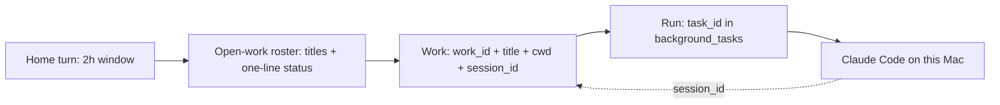

# Named Work

**Status:** Proposed  
**Date:** 2026-08-15  
**Priority:** High — this is the gap that keeps delegated work from surviving Home.  
**Depends on:** existing `background_tasks`, `agents.dispatch` / `resume` / `get_status`, Claude Agent SDK `session_id`, Activity task rows, review-rail receipts.  
**Does not depend on:** a new collection, Cursor API, model lanes, billing, chat projects, or Conductor HITL.

---

## Decision

Do **not** add a Job, Project, or chat-session product.

Promote what already exists: a **named work lineage** over `background_tasks`.

A **run** (`task_id`) is one agent execution. It can complete, fail, or be cancelled.  
**Work** (`work_id` + `title`) is the thing the user can name later: “the checkout PR.” It outlives a run, outlives the 2-hour Home window, and is what voice resolves. The worker’s transcript stays in the Claude Code `session_id`, not in Home.

User-facing speech is the **title**. Do not teach a new noun. Internally the field is `work_id`, not `job_id`.

---

## Why this is the primitive

Daily-use interviews collapsed to one sentence:

> Connect to the tools I already use, go do that thing, let me jump into **that task** and tweak it, without the next “lights off” drowning in that context.

JARV1S is the conductor. Cursor / Claude Code are the hands. Home should still forget after two hours. Delegated work should not.

That is not a Project (a folder). It is not a Job (a cron/queue word, and the industry has been renaming it away). It is not a Chat (Activity → Conversations is an audit log, and that is correct). It is a **stable handle for unfinished delegated work on this machine**.

### Why not a new Job entity

| Candidate | Verdict |
| :--- | :--- |
| **Job** | User’s colloquial word. Collides with scheduled jobs next to automations. Several agent codebases renamed `job` → `session`/`task` for that reason. Do not productize it. |
| **Project** | Folder / PM board. User could not name one pin. [CONDUCTOR_ORCHESTRATION.md](./CONDUCTOR_ORCHESTRATION.md) already rejected a JARV1S project registry. |
| **Session** | Already means WebSocket `Session`, the 2-hour conversation window, and Claude `session_id`. Too loaded. |
| **Task** | Already a **run** (`task_id`). `resume()` mints a **new** `task_id` while keeping `session_id`. That is why “go back to that job” dies: the run identity changes, and Home forgets the id. Keep `task_id` for runs. |
| **Agent** | Cursor’s phone/cloud object. Collides with `AgentsPlugin`. Fine as implementation slang, not UI copy. |
| **Work** | The lineage. Spoken as the title. Tools stay under `jarvis.agents.*`. |

### Research (what to copy, what not to)

- **Claude Code / Agent SDK:** the durable object is a `session_id`. Resume continues that transcript; fork is explicit. Resume is same-machine and cwd-sensitive. JARV1S already stores `session_id` and passes it to `resume=`. Copy this. Do not rebuild transcripts.
- **Cursor:** Cloud Agents run in a **clone VM**, which is why cafe steering cannot see desktop logs. Cursor’s newer Remote Control keeps tools on the Mac. That is Cursor’s product. JARV1S should not wrap Cursor Cloud in V1. The Host already has a desktop-resident worker: `mode="code"` on this Mac.
- **Conductor proposal:** HITL questions/approvals on a **running** task. Complementary, later. Without a name and a stable id, Conductor still feels like a toast.
- **Linear / Asana agents:** put the agent inside the existing issue, do not invent a second board. Optional `ref` (PR url, Jira key) on work is enough. No JARV1S kanban.
- **Apple Notifications:** inspectable policy for life events. That is **not** this proposal. Automations stay on `TriggerRule` + Settings-like Configured. Named work is delegated doing, not “let me know when.”

---

## Current state (the actual bug)

`background_tasks` already almost is this, and then throws the handle away:

1. **`resume()` creates a new `task_id`.** The Claude `session_id` is preserved, but voice and Activity see a different object. There is no `work_id` tying the lineage.
2. **No title.** Tools and receipts speak nanoids (`k8Tm4xQ2pR7n`). The user says “that PR job.”
3. **Home is a 2-hour cache.** `CONVERSATION_SESSION_INACTIVITY_MINUTES = 120`. After that, the model is told to `recall()`. Recall is search, not a noun. The user does not trust it, correctly.
4. **`get_status` on a completed run is a dead end.** “Terminal. Call `get_result`. Do not poll.” There is no “this work is still open; resume it.”
5. **cwd defaults to the JARV1S repo.** `_default_agent_cwd()` → `settings.BASE_DIR.parent`. User work lands in the assistant’s own tree unless the model guesses a path.
6. **House chat leaks into the worker.** `build_conversation_context()` injects the last 6 Home turns into every code dispatch/resume. Steer should be the new instruction plus the Claude session, not last night’s lights.
7. **`mode="jarvis"` cannot resume.** Fine for V1: named work is the **code** path (desktop files, git, the thing Cursor would do). Jarvis-mode stays fire-and-forget integration work until a later slice.
8. **Running steer is refused.** `resume()` errors if `status == "running"`. Cafe “tweak this” while it is working is Conductor/SDK `interrupt()`, not V1.

Activity already opens `BackgroundTaskWidget`. The rail already shows progress. The missing piece is identity, not another surface.

---

## Model



Home never loads the coding transcript.  
The worker never needs the Home transcript after the first dispatch prompt.

Open work is a **small roster** (titles, status, cwd), in the same spirit as Layer-1 profile facts: injected every turn, cheap, named. Miller’s law: a handful of open items, not a board.

---

## Data shape

No new collection. Additive fields on `background_tasks`:

```python
{
    "task_id": str,          # this run (unchanged)
    "work_id": str,          # stable across resume runs
    "title": str,            # "Checkout PR comments"
    "open": bool,            # True until user closes it or idle close
    "ref": str | None,       # optional "PR #412" / Jira key / path; not a schema
    "cwd": str,
    "session_id": str | None,
    "mode": "code" | "jarvis",
    # existing status, prompt, progress_summary, ...
}
```

Rules:

- First `dispatch(mode="code")` mints `work_id` (same generator as `task_id`) and a required `title`.
- `resume` inserts a new **run** with the **same** `work_id`, `title`, `cwd`, and Claude `session_id`.
- `open` stays true after a successful run. Completed ≠ closed. That is the whole point.
- Close is explicit (`agents.close` or “I’m done with the checkout PR”) or idle (days, not two hours). Closed work can keep the existing 30-day TTL. Open work must not.
- Resolution order for voice tools: exact `work_id` / `task_id`, then unique title / `ref` match among **open** work, then latest run in that lineage.

Index: `{owner_id: 1, work_id: 1, created_at: -1}` and `{owner_id: 1, open: 1}`.

---

## Tool surface

Keep `jarvis.agents.*`. Do not add `jarvis.work`.

| Tool | Change |
| :--- | :--- |
| `dispatch` | Require `title` on `mode="code"`. Persist `work_id`. Refuse to default cwd to the JARV1S repo; if cwd is missing, return `ok=false` with a clear error (the old silent default is a trust bug). |
| `resume` | Accept `target` (work_id, task_id, title, or ref), not only `task_id`. Same `work_id`. Still refuse running runs in V1. |
| `get_status` | Resolve `target` the same way. For completed **runs** of **open** work, return title, last result line, and “still open — resume to continue,” not a terminal dead end. Omit `target` → open work, not “all running nanoids.” |
| `get_result` / `list_tasks` | Prefer latest run per `work_id`. List **open work** by default. |
| `cancel_task` | Cancels the **run**. Does not close the work. |
| `close` | New, tiny: mark `open=false` on the lineage. |

Steer from a Home turn: the voice model calls `get_status` / `resume`. It does not paste the worker transcript into Home history.

Prompt change (one block, dynamic, not persona YAML):

```text
[OPEN WORK]
- Checkout PR comments — completed, open, ~/dev/shop
- Inbox triage — running
Refer to these by title. Use agents.get_status / resume. Do not recall() to find them.
```

Empty roster: omit the block.

---

## Runtime boundaries

| Layer | Owns | Must not |
| :--- | :--- | :--- |
| Home (`HistoryPolicy.interactive_user`) | 2-hour node window, lights, chat | Worker transcripts, work files |
| Open-work roster | Titles + status for the current owner | Full prompts, traces, diffs |
| `background_tasks` | Runs + lineage fields | A second source of truth |
| Claude `session_id` | Worker memory (decisions, files read) | Anything injected into Home |
| `TriggerRule` / Configured | Standing house policy | Being the resume handle |
| `todo` plugin | Personal checklist | Delegated coding work |
| Conductor (later) | Questions / approvals on a **run** | Identity of the work |

`mode="code"` is the V1 worker because it is on this Mac (logs, local app, real cwd). `mode="jarvis"` does not gain resume in this slice.

Cursor remains the **desk** inspect surface: same files on disk. JARV1S does not start or resume Cursor IDE threads in V1. Cafe steer applies to work **this Host dispatched**. If the user started a thread only inside Cursor, Cursor’s own app / Remote Control owns that. Do not pretend otherwise.

---

## What this does to existing systems

**Must change**

- `plugins/agents/_prepare_task` / `resume` / `dispatch` docstring: `work_id`, `title`, cwd required for code mode.
- `get_status` / `list_tasks` resolution and “open vs terminal run.”
- `PromptBuilder` dynamic tail: roster; stop stuffing Home turns into code resume (keep a short first-dispatch brief if useful, not every resume).
- Activity / rail copy: show `title`, group by `work_id` so resume is not a second unrelated row.
- TTL: only closed (or never-opened legacy) rows expire.

**Leave alone**

- 2-hour conversation window.
- Global `llm_config` / Cerebras vs local. Named work spends `BACKGROUND_AGENT_*`, which is already the other brain.
- Automations, prefetch, pulse, attention, setups.
- `recall()`. It stays for old chat, not as the work index.
- Conductor HITL, running `interrupt()`, Cursor API, GitHub PR watchers, Jira.

**Honest follow-ons (not this proposal)**

- Integrations (Outlook, GitHub, Jira) so a morning briefing can *continue* work, not only narrate it.
- Inspectable notification policy (“important message”) — Apple-shaped, separate from work handles.
- Local model for silent automations — cost, not identity.
- Pluggable worker: Cursor Remote Control / CLI as a second adapter behind the same `work_id`.

---

## Non-goals

- No `jobs` collection, plugin, or REST resource.
- No chat-session list as the home screen.
- No per-work API key or model picker.
- No billing dashboard.
- No mid-run interrupt / phone-steer of a **running** agent (status yes; tweak after it finishes yes; live interrupt is Conductor).
- No “watch this PR and auto-dispatch” automation.
- No CLAUDE.md / project files as the identity (cwd may contain them; JARV1S does not manage them).
- No Jarvis-as-coder quality program. The Host worker is “good enough to start/resume”; Cursor stays the serious editor.

---

## Phasing

**V1 — handle** (this doc)

- `work_id` + `title` + `open` on code dispatches.
- Resume/status/list resolve by title.
- Roster in the Home prompt.
- cwd required; no JARV1S-repo default.
- Receipts and Activity show titles.
- Close work explicitly.

**Not V1**

- Running interrupt.
- Jarvis-mode resume.
- Cursor adapter.
- External refs as a typed schema (a free-string `ref` is enough if the title is good).

---

## Acceptance

- After two hours, “what’s the status of the checkout PR work?” resolves without `recall()` and without the Home transcript.
- “Tweak it — use the existing tests” calls `resume` on the same `work_id` / `session_id`, not a new unrelated dispatch.
- “Turn the lights off” does not carry the PR transcript and does not blow the Home window.
- A completed run of open work is still findable; a closed work item is not in the roster.
- Dispatch without a title or cwd does not start a code task.
- Activity does not show two unrelated rows for one resume lineage.
- No new product noun in UI chrome. The rail says the title.

---

## Relationship to other proposals

| Doc | Relationship |
| :--- | :--- |
| [BACKGROUND_AGENTS.md](../BACKGROUND_AGENTS.md) | Normative runtime. This adds lineage on top of runs. |
| [CONDUCTOR_ORCHESTRATION.md](./CONDUCTOR_ORCHESTRATION.md) | Later: questions/approvals/running interrupt **on a named run**. Do not start Conductor first. |
| [AUTOMATION_PRIMITIVE.md](./AUTOMATION_PRIMITIVE.md) | Standing rules stay `TriggerRule`. Do not reuse work handles for lights/birthdays. |
| [MORNING_BRIEFING.md](./MORNING_BRIEFING.md) | Briefing can **mention** open work from the roster. It must not become the work store. |
