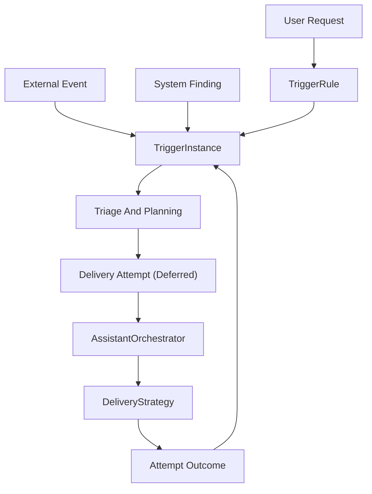
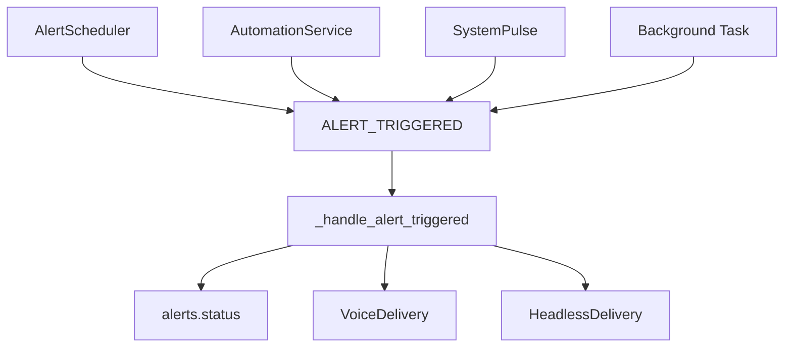
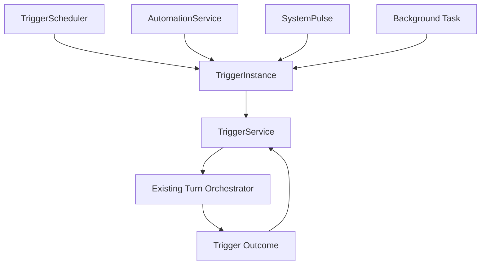

# Trigger Substrate Refactor

**Status:** Implemented as `core.triggers`  
**Date:** 2026-05-04  
**Priority:** Conditional High. Do this before Phase 10 multi-channel delivery, DND, intelligent triage, acknowledgement loops, or reaction tracking. Defer it if AEC, installability, or multi-room satellite work becomes the next product bucket.  
**Depends on:** Current Phase 9 delivery modes, `VoiceDelivery` / `HeadlessDelivery`, automation trigger scaling, and the existing scheduler recurrence helpers.

**Implementation note:** This proposal originally used `NotificationRule` / `NotificationInstance` as the working names. The implemented substrate is broader:

| Proposal name | Implemented name |
| --- | --- |
| `NotificationRule` | `TriggerRule` |
| `NotificationTrigger` | `TriggerOrigin` |
| `NotificationAction` | `TriggerAction` |
| `NotificationInstance` | `TriggerInstance` |
| `NotificationService` | `TriggerService` |
| `NotificationScheduler` | `TriggerScheduler` |
| `notification_rules` | `trigger_rules` |
| `notification_instances` | `trigger_instances` |
| `NOTIFICATION_DUE` | `TRIGGER_DUE` |

The current model also distinguishes generic work completion (`status="completed"`) from successful user-facing delivery (`status="delivered"`). Delivery attempts remain deferred; see [NOTIFICATION_ATTEMPTS_FUTURE.md](../NOTIFICATION_ATTEMPTS_FUTURE.md).

---

## Problem

The current system works, but it asks both the user and the agent to know too many product-specific nouns:

| User-facing word | Current implementation |
| --- | --- |
| timer | `scheduler.add_timer()` creates a `TriggerInstance` with interval origin |
| alarm | `scheduler.add_alarm()` creates a critical `TriggerInstance` / recurring `TriggerRule` |
| reminder / alert | `scheduler.remind()` creates a notify `TriggerInstance` / recurring `TriggerRule` |
| automation | `automations.create_rule()` creates an external-origin `TriggerRule`; fires materialize `TriggerInstance`s |
| protocol-linked alert | scheduler or automation sets `action.protocol_name`, then orchestrator builds a protocol system turn |
| system pulse | `SystemPulse` creates a system-origin `TriggerInstance` |

This makes the architecture brittle:

- A user says "alert me in ten minutes" but may really mean timer, reminder, or alarm.
- Durable scheduler alerts and ephemeral automation alerts share `ALERT_TRIGGERED` but not storage or replay semantics.
- `delivery_mode` mixes agent execution behavior (`silent`, `on_exception`) with user notification policy.
- `pending_delivery` is a catch-all for offline delivery, crash recovery, and no-audio outcomes.
- Protocols are recipes, but the trigger path decides whether they are reminders, automations, or direct runs.
- Future WhatsApp / Telegram / room routing needs durable channel addressing and delivery attempts, not "send voice over current websocket".

The core issue: **`alert` is doing too much.**

---

## Goal

Make the durable primitive a **Trigger Intent**:

> Something happened or is due. JARV1S may need to do work, notify the user, wait for acknowledgement, escalate, or quietly record the outcome.

Timers, reminders, alarms, automations, protocol schedules, system pulse findings, and background task completions should become presets over the same pipeline.

This refactor should be large enough to clean the model, but not so generic that it becomes an enterprise notification platform.

---

## Non-Goals

- Do not rewrite `AssistantOrchestrator.process_turn()` or `_execute_turn()`.
- Do not replace `VoiceDelivery` / `HeadlessDelivery`; they remain execution backends.
- Do not build Telegram / WhatsApp in this refactor. Make the data model ready for them.
- Do not add a queueing framework. MongoDB atomic claims are enough for this personal assistant.
- Do not fold the soft-mute input bug into the notification refactor. Fix it as a separate prerequisite or follow-up.
- Do not pretend existing local state is disposable. There are no external users, but the owner still has reminders, alarms, and automations.

---

## Pre-Refactor Code Map

### Scheduler

Files:

- `backend/plugins/scheduler.py`
- `backend/services/scheduler.py`
- `backend/core/scheduling/occurrence.py`

Current behavior:

- `add_alert`, `add_timer`, and `add_alarm` all call `_create_alert()`.
- `_create_alert()` writes directly to `mongodb.db.alerts`.
- Recurring schedules write a separate `mongodb.db.schedules` rule.
- `AlertScheduler` polls `alerts` where `status="pending"` and `trigger_time <= now`.
- It atomically moves an alert to `status="firing"` and publishes `EventType.ALERT_TRIGGERED`.
- Recurring alerts insert the next occurrence with `build_occurrence_doc()`.

Strength:

- Simple, durable, timezone-aware enough, and reconnect replay works for scheduled items.

Weakness:

- `alerts` is both the scheduled occurrence and the delivery state machine.
- `type` is product wording, not behavior.
- Delivery outcome is inferred from `session.last_turn_audio_sent`.

### Automations

Files:

- `backend/plugins/automations.py`
- `backend/services/automation.py`
- `backend/api/routes/webhooks.py`
- `backend/api/routes/push.py`

Current behavior:

- `create_rule()` writes external-origin definitions to `trigger_rules`.
- Poll and push paths evaluate `TriggerRule` records directly.
- `_fire()` creates a `TriggerInstance` and publishes `TRIGGER_DUE`.
- Missed delivery follows the trigger delivery lifecycle instead of being dropped.

Strength:

- Good trigger model: trigger, conditions, action.
- Push and poll paths are already converging around `TriggerEvent`.

Weakness:

- The action schema duplicates delivery concepts from scheduler.
- Automation results use the alert handler but not alert durability.
- The user has to choose "automation" when they may simply mean "notify me when X happens".

### Orchestrator Delivery

Files:

- `backend/core/turns/orchestrator.py`
- `backend/core/turns/delivery.py`
- `backend/core/prompts/system_turn_context.py`

Current behavior:

- `_handle_alert_triggered()` is the central proactive handler.
- It resolves `delivery_mode`:
  - `announce`: sound + `process_turn()` + `VoiceDelivery`.
  - `silent`: `_run_headless_turn()` + `HeadlessDelivery`.
  - `on_exception`: headless evaluation, then `_deliver_text()` only if not `NO_REPLY`.
- It marks scheduler alerts delivered or `pending_delivery`.
- It replays `pending_delivery` alerts only on `SESSION_CONNECTED`.

Strength:

- The agent loop is already delivery-agnostic.
- `VoiceDelivery` and `HeadlessDelivery` are the right low-level split.

Weakness:

- `_handle_alert_triggered()` owns too many policy decisions.
- Delivery status is written back to `alerts`, not to a delivery attempt record.
- Channel is hard-coded as `"voice"` when resolving delivery mode.

### Prefetch

Files:

- `backend/services/prefetch.py`
- `backend/core/turns/orchestrator.py`

Current behavior:

- Scans upcoming `alerts` and anticipated automation fires with linked protocols.
- Runs a headless pre-render for safe announce-mode protocols.
- Caches by `(source, trigger_id, protocol_name)`.
- Orchestrator consumes cache at fire time.

Strength:

- Good optimization and should survive the refactor.

Weakness:

- It has to know both `alerts` and automation candidates.
- Cache keys are source-specific because there is no common trigger instance id.

---

## Target Vocabulary

| Name | Meaning | Replaces / absorbs |
| --- | --- | --- |
| `TriggerRule` | Durable user/system rule that can produce trigger instances. | `schedules`, `automations` rule shell |
| `TriggerOrigin` | When/why the rule fires. | alert `trigger_time`, recurrence, automation `trigger` |
| `TriggerCondition` | Cheap deterministic filters before agent work. | automation `conditions`, future DND/context filters |
| `TriggerAction` | What JARV1S should do when it fires. | alert message, protocol, dispatch_agent, directive |
| `AttentionPolicy` | How interruptive / persistent this should be. | `type`, sound, priority, awaiting delivery behavior |
| `DeliveryPlan` | Minimal current delivery marker. Future channel targeting belongs to the delivery bridge. | current voice delivery |
| `TriggerInstance` | One concrete occurrence/fire of a rule. | `alerts` row, automation fire event |
| `TriggerDeliveryAttempt` | Deferred: one attempt to deliver one instance to one channel. | inferred `last_turn_audio_sent`, replay side effects |

The word **alert** should be reserved for an attention policy: an urgent or persistent notification that repeats/escalates until acknowledged or resolved.

---

## Target Flow



---

## Data Model

Use Pydantic models for boundaries and plain MongoDB documents for persistence.

```python
from __future__ import annotations

from pydantic import BaseModel, Field
```

### `TriggerRule`

Collection: `trigger_rules`

```python
class TriggerRule(BaseModel):
    id: str
    owner_id: str
    name: str
    enabled: bool = True
    created_at: datetime
    updated_at: datetime

    origin: TriggerOrigin
    conditions: list[TriggerCondition] = Field(default_factory=list)
    action: TriggerAction
    attention: AttentionPolicy
    delivery: DeliveryPlan

    paused_until: datetime | None = None
    exceptions: list[str] = Field(default_factory=list)
    suppressed_event_ids: list[str] = Field(default_factory=list)
```

Rules are optional. One-shot reminders can either create a rule plus one instance, or just create an instance directly. Prefer creating a rule for anything recurring or externally triggered.

### `TriggerOrigin`

```python
class TriggerOrigin(BaseModel):
    kind: Literal["time", "interval", "external", "manual", "system"]

    # time / interval
    fire_at: datetime | None = None
    duration_s: int | None = None
    recurrence: str | None = None
    timezone: str | None = None
    original_local_time: str | None = None

    # external
    source: str | None = None        # "calendar", "gmail", "slack"
    event: str | None = None         # normalized event type
    offset_minutes: int = 0
```

Mapping:

- `add_timer("10m")` -> `kind="interval"`, `duration_s=600`.
- `add_alarm("7am")` -> `kind="time"`, high attention.
- `notify me when Slack mentions X` -> `kind="external"`.
- `SystemPulse` -> direct instance with `kind="system"` or a synthetic rule.

### `TriggerAction`

```python
class TriggerAction(BaseModel):
    decision: Literal["tell", "offer", "act"]
    message: str = ""
    protocol_name: str | None = None
    instructions: str | None = None
    content_type: Literal["plain", "event", "task_result"] | None = None
    reply_grounding: dict[str, Any] = Field(default_factory=dict)
```

Interpretation:

- `tell`: run user-facing and present the result.
- `offer`: evaluate headlessly, then present only useful content.
- `act`: do the work headlessly without presentation.
- `protocol_name`: build protocol context and run the protocol at fire time.

This replaces the current `delivery_mode="on_exception"` coupling. Evaluative behavior belongs to the action, not to the delivery channel.

`instructions` is user-authored policy passed into `SystemTurnContext`. It is
not parsed by `TriggerService` and must not control channel routing. Use it only
when the agent must interpret a lifecycle rule at fire time. `reply_grounding`
contains only semantic data needed for a proactive utterance and its
immediate reply; ownership/correlation belongs in `management`, and dynamic
provider data belongs in `source_event`.

### `AttentionPolicy`

```python
class AttentionPolicy(BaseModel):
    level: Literal["passive", "normal", "urgent", "critical"] = "normal"
    requires_ack: bool = False
    sound: Literal["none", "chime", "timer", "alarm"] = "chime"
```

Presets:

| Preset | Policy |
| --- | --- |
| reminder | `normal`, no ack, chime |
| timer | `urgent`, timer sound |
| alarm | `critical`, requires ack, alarm sound |
| passive automation | `passive`, no sound, usually evaluate or silent |
| system health alert | `urgent`, usually evaluative |

Class-wide mute, DND, channel overrides, expiry windows, and interruption policy should not live on individual instances until Phase 10 actually implements that planner behavior.

### `DeliveryPlan`

```python
class DeliveryPlan(BaseModel):
    channel: Literal["voice"] = "voice"
```

This is intentionally small. The future delivery bridge should own channel names, target resolution, fallback routing, provider-specific metadata, and attempt records. The trigger model should not hard-code Telegram, WhatsApp, email, or room targeting before those adapters exist.

### `TriggerInstance`

Collection: `trigger_instances`

```python
class TriggerInstance(BaseModel):
    id: str
    rule_id: str | None = None
    owner_id: str
    status: Literal[
        "pending",
        "claimed",
        "executing",
        "awaiting_delivery",
        "completed",
        "delivered",
        "acknowledged",
        "snoozed",
        "suppressed",
        "expired",
        "cancelled",
        "failed",
    ]

    due_at: datetime
    created_at: datetime
    claimed_at: datetime | None = None
    completed_at: datetime | None = None

    origin_snapshot: TriggerOrigin
    action_snapshot: TriggerAction
    attention_snapshot: AttentionPolicy
    delivery_snapshot: DeliveryPlan

    source_event: dict[str, Any] = Field(default_factory=dict)
    dedup_key: str | None = None
    result_text: str | None = None
    failure_reason: str | None = None
```

Important: execution reads snapshots from the instance, not the mutable rule. Updating a rule affects future instances only.

### Delivery Attempts

Deferred. Do not add attempt records until there are multiple real user-facing channels or provider callbacks that need per-try state.

```python
class TriggerDeliveryAttempt(BaseModel):
    id: str
    instance_id: str
    owner_id: str
    channel: str
    target: str | None
    status: Literal[
        "queued",
        "sending",
        "sent",
        "delivered",
        "acknowledged",
        "suppressed",
        "failed",
        "no_target",
    ]

    turn_id: str | None = None
    response_id: str | None = None
    audio_sent: bool = False
    error: str | None = None
    created_at: datetime
    completed_at: datetime | None = None
```

This is where `last_turn_audio_sent` would get recorded if attempts are reintroduced. The current implementation records the outcome directly on `TriggerInstance` (`completed`, `delivered`, `awaiting_delivery`, etc.).

Promote attempts to a separate `trigger_delivery_attempts` collection only when at least two real channels exist with independent retry, acknowledgement, or provider callback semantics. Until then, keep the model simple.

---

## Proposed Code Layout

Add:

```text
backend/core/triggers/
  __init__.py
  models.py
  presets.py
  service.py
  scheduler.py
```

Responsibilities:

| File | Responsibility |
| --- | --- |
| `models.py` | Pydantic models and enums |
| `presets.py` | User-facing constructors: reminder, timer, alarm, automation/system triggers |
| `service.py` | Create rules/instances, claim due instances, complete/fail/snooze/cancel |
| `scheduler.py` | Poll `trigger_instances` and materialize recurring rule instances |

Keep:

- `backend/core/turns/orchestrator.py`
- `backend/core/turns/delivery.py`
- `backend/core/prompts/system_turn_context.py`
- `backend/services/automation.py` watcher/push machinery
- `backend/core/scheduling/*` recurrence helpers, after renaming alert language where useful

Delete or heavily shrink:

- `backend/services/scheduler.py` as `AlertScheduler`
- direct writes to `mongodb.db.alerts`
- alert-status helpers in `AssistantOrchestrator`
- `pending_delivery` replay logic in orchestrator

---

## Event Types

Replace `ALERT_TRIGGERED` as the main internal primitive.

Add:

```python
TRIGGER_DUE = "trigger.due"
TRIGGER_ACKED = "trigger.acked"
TRIGGER_RETRY_AWAITING = "trigger.retry_awaiting"
```

`TriggerScheduler` publishes `TRIGGER_DUE` for claimed instances. Other producers, such as agents and system pulse, create a `TriggerInstance` and publish the same event.

The legacy `ALERT_TRIGGERED` path has been removed from active producers.

---

## Execution Semantics

### `notify`

1. Build `system_context` from `SystemTurnContext`.
2. Claim pending instances atomically before execution; only claimed instances move to `executing`.
3. If delivery target is `voice`, execute through `process_turn(source="system")`.
4. Mark the instance `delivered` only if audio was sent or the channel confirms delivery.
5. Otherwise mark it `awaiting_delivery` for retry.

Delivery finalization is guarded in `TriggerService`: only `claimed` / `executing` instances can be moved to `delivered` or `awaiting_delivery`. A local acknowledgement, snooze, cancellation, or failure that lands while audio is playing wins and is not overwritten by the finalizer.

### `evaluate`

1. Run `_run_headless_turn()` with `HeadlessDelivery`.
2. If `NO_REPLY`, mark instance `suppressed`.
3. If there is output, deliver it through `_deliver_text()` and mark `delivered` only when audio is sent.
4. If the session is unavailable or no audio is sent, mark `awaiting_delivery`.
5. If the headless evaluation crashes, mark `failed`.

This replaces current `delivery_mode="on_exception"`.

### `run_protocol`

1. Build protocol context with `build_protocol_context()`.
2. If prefetch exists and valid, deliver cached text using `trigger_data` / `instance_id` as the live cache key.
3. Prefetched delivery uses the same guarded trigger finalizer as live delivery.
4. Otherwise execute the protocol using the same path as today.
5. Protocol run logging remains in orchestrator.

### `dispatch_agent`

1. Call `agents_plugin._dispatch()`.
2. Store task id on the instance.
3. Background task completion creates a second `TriggerInstance` with action `notify` or `evaluate`.

---

## Soft Mute And Availability

The soft-mute bug is real, but it should be fixed outside this migration. It is not a notification concept.

Current failure mode:

1. `SpeechProcessor` detects barge-in and publishes `VOICE_USER_START`.
2. `AssistantOrchestrator._handle_interruption()` cancels the active system turn.
3. Only later does `handlers._handle_local_voice_command()` resolve the transcript and drop it because `session.soft_muted` is true.
4. The alert was finalized as `pending_delivery` because no audio was sent.
5. Replay only happens on websocket reconnect.

Target behavior:

- Soft mute is an input availability state, not an output delivery policy.
- Muted ambient speech must not cancel an active notification attempt.
- "Unmute" remains a local command that can be recognized without treating all speech as barge-in.
- Availability changes should wake the notification planner, not rely on websocket reconnect.

Separate bug-fix implementation:

- In `handlers.py`, drop ambient `VOICE_USER_START` before publication when `session.soft_muted` is true, while allowing explicit local command passthrough for `unmute`, `stop`, `acknowledge`, `dismiss`, and `snooze`.
- Keep a defensive guard in `AssistantOrchestrator._handle_interruption()` so stale ambient `VOICE_USER_START` events cannot cancel active delivery.
- In the new notification planner, voice delivery can create an attempt with `status="no_target"` or leave the instance `awaiting_delivery` when the user is disconnected. Soft mute alone should not block outbound delivery unless a future user preference explicitly says "mute JARV1S output too".

### Availability Retry

Removing `pending_delivery` required an explicit retry wakeup.

Legacy behavior used `SESSION_CONNECTED` to replay `pending_delivery` alerts. The replacement is:

```python
TRIGGER_RETRY_AWAITING = "trigger.retry_awaiting"
```

Sources:

- `SESSION_CONNECTED`
- websocket stale-session recovery
- user `UNMUTE`
- future channel-specific availability callbacks

Handler behavior:

1. Load `trigger_instances` for the owner with `status="awaiting_delivery"`.
2. Atomically move each retry candidate from `awaiting_delivery` to `claimed`.
3. Re-publish `TRIGGER_DUE` for available delivery.
4. Mark successful voice output `delivered`.
5. Leave the instance awaiting if no channel is available.

This is the replacement for reconnect replay; without it, the refactor silently loses one of the few durable behaviors that works today.

---

## Acknowledgement Loop

`AttentionPolicy.requires_ack` is intentionally minimal for now. It is an instance lifecycle flag for alarms and alarm-like trigger deliveries, not a delivery-attempt system.

Required semantics:

- Local `stop` / `acknowledge` / `dismiss` marks the latest ackable instance `acknowledged`.
- Local `snooze` marks the latest ackable instance `snoozed` and creates a new instance linked to the original.
- Local voice commands like "stop", "acknowledge", "dismiss", and "snooze ten minutes" must route to trigger acknowledgement before they are treated as generic assistant turns.
- Soft mute must not prevent explicit acknowledgement commands from being recognized.

Implementation boundary:

- Do not add broad LLM-facing ack tools until there is a real product need.
- Do not add delivery attempts just to support acknowledgement.
- Keep acknowledgement state on `TriggerInstance`; keep owner-level preferences separate.

---

## User-Facing Tool Changes

### Scheduler Plugin

Replace the LLM-facing surface with:

```python
async def remind(
    when: str,
    message: str,
    recurrence: str | None = None,
    importance: Literal["normal", "urgent", "critical"] = "normal",
    protocol: str | None = None,
    only_if: str | None = None,
) -> str
```

Keep compatibility wrappers:

- `add_alert()` -> `remind(..., importance="normal")`
- `add_timer()` -> `remind(..., importance="urgent", preset="timer")`
- `add_alarm()` -> alarm preset with `requires_ack=True`

The wrappers should no longer be `manifest="full"` once the new tool is stable. The model should see one primary scheduling tool.

### Automations Plugin

Keep `create_rule()`, but change its action schema to use trigger concepts:

```python
action: {
  "kind": "notify" | "evaluate" | "run_protocol" | "dispatch_agent",
  "message": "...",
  "protocol": null,
  "attention": {...},
  "delivery": {...},
  "directive": null
}
```

The rule engine should create `TriggerInstance` instead of publishing `ALERT_TRIGGERED`.

Do not make the LLM assemble this full nested shape for common cases. Add helper tools:

- `create_trigger_rule(...)` for simple "notify me when X" rules.
- `create_evaluative_rule(...)` for "only tell me if it matters" rules.
- `create_protocol_rule(...)` for external trigger -> protocol execution.

Keep the structured `create_rule()` as the advanced escape hatch, but make the common path flat enough for CodeAct to emit reliably.

### Protocol Plugin

Protocols stay recipes. Do not add delivery fields to protocols.

Protocol invocation context decides:

- run now and speak,
- run silently,
- prefetch,
- schedule for later,
- deliver to a remote channel later.

---

## Migration Strategy

Because there are no external users, prefer a clean code cut but an honest data migration. The owner is still a real user with local reminders, alarms, and automations.

Current state: scheduled reminders, timers, alarms, and automation deliveries now use `trigger_rules` / `trigger_instances`; legacy `alerts` and `schedules` collections have been removed from the active MongoDB schema.

Completed migration scope:

```text
legacy scheduled-work collections -> trigger_rules + trigger_instances
automations.action -> action/attention/delivery trigger shape
```

Active code writes scheduled work through `TriggerRule` / `TriggerInstance`, automation fires create trigger instances, SystemPulse escalations create trigger instances, and old collection reads have been dropped.

If the owner chooses to wipe local state instead, make that an explicit manual step before the migration lands. Do not leave the proposal implying that "no users" means no data loss.

---

## Database Indexes

Add in `backend/services/database/mongodb.py`:

```python
await self.db.trigger_rules.create_index("owner_id")
await self.db.trigger_rules.create_index([("owner_id", 1), ("enabled", 1)])
await self.db.trigger_rules.create_index([("origin.kind", 1), ("enabled", 1)])

await self.db.trigger_instances.create_index([("due_at", 1), ("status", 1)])
await self.db.trigger_instances.create_index([("owner_id", 1), ("status", 1), ("due_at", -1)])
await self.db.trigger_instances.create_index([("owner_id", 1), ("attention_snapshot.level", 1), ("status", 1)])
await self.db.trigger_instances.create_index("rule_id", sparse=True)
await self.db.trigger_instances.create_index("dedup_key", unique=True, sparse=True)

await self.db.owner_attention_state.create_index("owner_id", unique=True)
```

For external events, `dedup_key` is unique when present because the rule id is included in it:

```text
dedup_key = f"{rule_id}:{source}:{event_id}"
```

---

## Refactor Phases

### Phase 0: Preflight Fix And Eval Harness

Files:

- `backend/core/turns/orchestrator.py`
- `backend/api/websockets/handlers.py`
- `backend/tests/`
- `backend/evals/trigger_delivery.yaml`
- `backend/tools/evaluate_trigger_delivery.py`

Changes:

- Fix soft mute as a separate input-pipeline bug.
- Add fixtures around current proactive delivery behavior before changing the implementation.
- Cover scheduler alert, offline replay, no-audio outcome, `decision="offer"` suppression, automation fire, and protocol prefetch.

Acceptance:

- Current path passes the trigger delivery eval before the refactor starts.
- The same eval can run against the new trigger path for parity.
- Soft-muted ambient speech cannot cancel proactive delivery.

### Phase 1: Add Trigger Core

Files:

- `backend/core/triggers/models.py`
- `backend/core/triggers/presets.py`
- `backend/core/triggers/service.py`
- `backend/core/triggers/scheduler.py`
- `backend/services/database/mongodb.py`
- `backend/services/events/types.py`
- `backend/main.py`

Acceptance:

- Can create a one-shot reminder instance.
- Scheduler claims due instances atomically.
- No orchestrator behavior changed yet.

### Phase 2: Move Scheduler Plugin

Files:

- `backend/plugins/scheduler.py`
- `backend/core/triggers/presets.py`
- scheduler tests

Changes:

- `add_alert`, `add_timer`, `add_alarm`, and `remind` call trigger presets.
- Recurrence creates `TriggerRule` plus next `TriggerInstance`.
- `get_alerts()` lists pending/imminent trigger instances plus active recurring series for scheduler edit flows (`instance_id` / `series_id`, countdowns, snooze/skip/cancel). Durable inventory across schedules, automations, and protocols lives in `activity.list_setups()`.
- `snooze_alert()` operates on trigger instances.
- Series tools operate on `TriggerRule`.

Acceptance:

- Existing timer/reminder/alarm tests pass against new collections.
- User-facing responses stay simple.

### Phase 3: Trigger Delivery Finalization

Files:

- `backend/core/turns/orchestrator.py`
- `backend/core/turns/delivery.py`
- delivery tests

Changes:

- Add trigger finalization helpers around existing orchestrator delivery methods.
- Successful user-facing output calls `trigger_service.mark_delivered()`.
- Generic/silent work completion calls `trigger_service.complete_instance()`.
- Guard `mark_executing()`, `mark_delivered()`, and `mark_awaiting_delivery()` by lifecycle state so finalizers cannot overwrite acknowledged, snoozed, cancelled, or failed instances.
- Remove `_mark_alert_delivered`, `_mark_alert_pending_delivery`, and `_wrap_with_alert_finalize`.

Acceptance:

- Voice delivery still uses `VoiceDelivery`.
- Headless evaluation still uses `HeadlessDelivery`.
- Failed/no-audio delivery produces `awaiting_delivery` or `failed`, not `pending_delivery`.
- Evaluative triggers settle according to the actual headless/delivery outcome: `suppressed`, `delivered`, `awaiting_delivery`, or `failed`.

### Phase 4: Move Automations

Files:

- `backend/plugins/automations.py`
- `backend/services/automation.py`
- automation tests

Changes:

- Automation `_fire()` creates `TriggerInstance` instead of publishing `ALERT_TRIGGERED`.
- `dispatch_agent` either remains direct or becomes `TriggerAction(kind="dispatch_agent")`.
- Automation fired dedup remains, but stores the produced `instance_id`.

Acceptance:

- Push and poll automations still fire.
- External event dedup is preserved.
- Automations can opt into durable delivery by choosing an attention policy.

### Phase 5: Move System Pulse And Prefetch

Files:

- `backend/services/system_pulse.py`
- `backend/services/prefetch.py`
- `backend/core/turns/orchestrator.py`

Changes:

- SystemPulse creates evaluative trigger instances.
- Prefetch scans upcoming `TriggerInstance` rows where `action.decision="tell"` and `action.protocol_name` is set.
- Prefetch cache keys use `source="trigger"` + `instance_id` for trigger instances, and `source="automation"` + `rule_id:item_id` only for anticipated automation fires that are not materialized yet.

Acceptance:

- Pulse still has zero LLM cost on empty ticks.
- Prefetch still consumes cached protocol output at fire time.

### Phase 6: Remove Old Alert Path

Files:

- `backend/services/scheduler.py`
- `backend/services/events/types.py`
- `backend/core/turns/orchestrator.py`
- docs/tests

Changes:

- Delete or rename `AlertScheduler`.
- Remove `ALERT_TRIGGERED` producers and orchestrator subscription.
- Remove active reads/writes to `alerts` and `schedules`.
- Update docs to use trigger vocabulary.

Acceptance:

- `rg "ALERT_TRIGGERED|pending_delivery|mongodb.db.alerts|mongodb.db.schedules"` finds only migration notes or compatibility tests.

---

## What This Simplifies

### Before



### After



---

## Design Rules

1. `TriggerRule` defines future behavior.
2. `TriggerInstance` freezes one occurrence.
3. Delivery attempts stay deferred until real channel complexity demands them.
4. `AttentionPolicy` decides how hard JARV1S should try.
5. `DeliveryPlan` is a minimal current-delivery marker; the future delivery bridge decides where JARV1S should try.
6. `TriggerAction` decides whether the agent runs, a protocol runs, or a direct message is delivered.
7. Protocols remain pure recipes.
8. Channels are not delivery modes.
9. `NO_REPLY` is an evaluation result, not a delivery mode.
10. The orchestrator runs turns; trigger service owns trigger state.
11. Trigger state transitions should be guarded by current status when they settle delivery outcomes.

---

## Open Decisions

### Should one-shot reminders create rules?

Recommendation: no. Create a `TriggerInstance` directly unless recurrence or external trigger exists.

### Should automations always be durable?

Recommendation: yes, but expiry can be immediate. A passive automation can create an instance that suppresses or expires quickly. This gives consistent audit and delivery behavior without forcing every automation to replay.

### Should attempts be embedded or a collection?

Recommendation: do not implement attempts yet. Embed `TriggerDeliveryAttempt` on `TriggerInstance` first if a second channel needs independent provider callbacks, retry windows, or acknowledgement semantics. Promote to `trigger_delivery_attempts` only after there is a proven query need.

### Should `delivery_mode` survive?

Recommendation: not as a top-level concept. Split it:

| Old `delivery_mode` | New shape |
| --- | --- |
| `announce` | `action.decision="tell"` + `delivery.channel="voice"` |
| `silent` | `action.decision="act"` |
| `on_exception` | `action.decision="offer"` |
| `prefetched` | attempt optimization / `metadata.prefetched=true` |
| `suppressed` | instance or attempt outcome |

### Should "alert" remain in tool names?

Recommendation: only as a compatibility alias. The primary LLM-facing tool should be `remind()` or a future `schedule_trigger()`, with docstrings teaching the model that it chooses behavior from user intent.

### Should trigger rules be memory?

Recommendation: not initially. Rules are operational state, while memory is recallable user knowledge. Avoid dual writes at first. Later, expose a derived read model so memory/retrieval can answer questions like "what recurring things do you know about my mornings?" without duplicating the rule itself into archival memory.

---

## Testing Plan

Add focused unit tests:

- Create one-shot reminder instance.
- Create timer preset with timer attention policy.
- Create alarm preset with required ack.
- Create recurring rule and materialize next instance.
- Claim due instance atomically.
- Evaluative instance suppresses on `NO_REPLY`.
- Voice delivery no-audio outcome moves the instance to `awaiting_delivery`.
- Automation fire creates trigger instance with dedup key.
- Prefetch uses `instance_id`.
- Snooze creates a new instance linked to the original.
- Compatibility wrappers call the new service.

Add an eval harness:

- Stable YAML fixtures for "right trigger, right moment, right channel, right outcome".
- A runner that verifies the trigger path after legacy alert delivery is removed.
- Fixtures for offline retry, soft-muted ambient speech, explicit acknowledgement, evaluative suppression, automation dedup, and protocol prefetch.
- Run the eval after Phase 3 and Phase 6 so parity is measured before the old path is deleted.

---

## Documentation Updates

Update:

- `docs/ARCHITECTURE.md`
- `docs/SYSTEM_STATES.md`
- `docs/ROADMAP.md`
- `docs/CORE_TOOLS.md`

Key language:

- "Alert" is an attention style, not the universal primitive.
- "Trigger" is the durable proactive work unit.
- "Delivery attempt" is deferred until channel-specific outcome tracking is needed.
- "Protocol" is a recipe invoked by trigger action or direct user command.

---

## Final Recommendation

Do the refactor now only if Phase 10 is next. If AEC, installability, or multi-room satellite takes priority, fix soft mute and defer this until multi-channel / DND / reaction tracking is actually on deck.

The right architecture for JARV1S is not separate systems for reminders, timers, alarms, automations, and protocol schedules. It is one trigger pipeline with small presets:

```text
origin + conditions + action + attention + delivery -> instance -> outcome
```

That gives the product the language it needs:

- "remind me" = normal attention trigger
- "timer" = interval trigger with timer attention
- "alarm" = critical trigger requiring ack
- "automation" = external trigger producing trigger instances
- "protocol schedule" = trigger action that runs a protocol
- "only tell me if it matters" = evaluative action

It also gives the architecture the extension point it needs for rooms, Telegram, WhatsApp, quiet hours, acknowledgements, and escalation without revisiting the scheduler every time.
