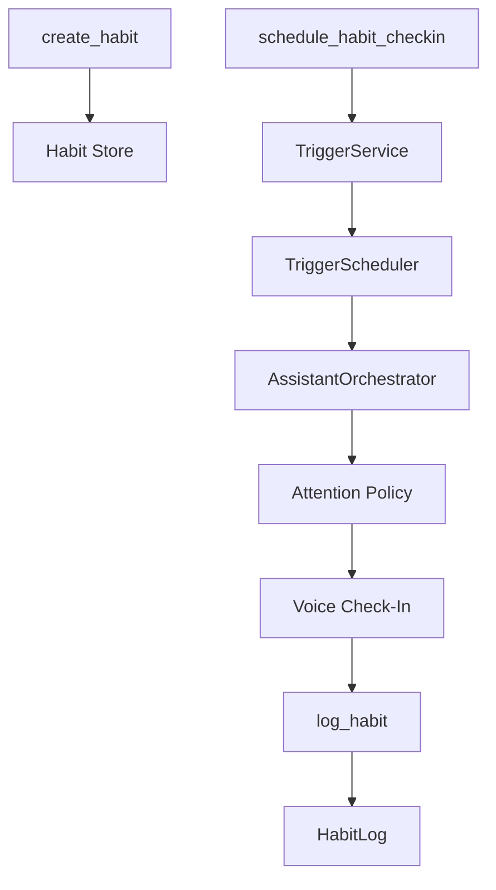

# Habits And Goals

> **Partial** — Shipped: V0 (`habits` plugin). Open: V1+ ([ROADMAP](../../ROADMAP.md) Phase 10.5).

**Status:** V0 implemented; V1 proposed  
**Date:** 2026-05-24  
**Priority:** Medium — personal habit support is central to the product vision, but the first slice must validate behavior change before building a full habit platform.  
**Depends on:** Existing plugin architecture, `TriggerService`, `AttentionService`, server-driven UI receipts/content widgets, MongoDB persistence.

---

## Problem

The goal is not to build a gamified to-do list. The goal is to test whether JARV1S can help the user actually follow through on habits and goals over weeks.

The earlier broad plan had the right architectural direction, but it was overbuilt for the real uncertainty. It proposed goals, habits, routines, scoring, widgets, daily closeout, weekly reviews, and memory integration before proving the central loop:

> Does an ambient, voice-first assistant help the user act differently in real life?

That is the product risk. If the check-in loop is annoying, untrusted, or easy to ignore, a larger habits plugin will only create more surface area around a failed behavior loop.

---

## Diagnosis

JARV1S has advantages that a normal habit app does not:

- Voice logging is lower friction than opening an app.
- Proactive triggers can ask at the right time.
- Attention modes can avoid interrupting during quiet or paused periods.
- Conversation history and profile memory can preserve motivation and preferences.
- Widgets can make progress visible without forcing app navigation.
- Future ambient context can improve timing and reduce self-report burden.

But those advantages only matter if the first version tests them directly. V0 should validate voice-mediated accountability and cue-based reminders, not build a full goal-management system.

---

## Design Principles

### 1. Prove The Loop Before The Platform

V0 should support a tiny end-to-end loop:

```text
Define one habit -> attach it to a cue -> JARV1S checks in -> user answers by voice -> log event -> review patterns -> adjust habit
```

If that loop does not help, goals, points, routines, and dashboards will not fix it.

### 2. Habits Are Cue-Based, Not Score-Based

The core habit model is:

```text
Habit = behavior + cue + minimum version + desired frequency + log history
```

Points may become useful feedback later, but they should not be the theory of change in V0. The first theory of change is cue anchoring, self-monitoring, and timely review.

### 3. Coaching Must Be Non-Shaming

Misses are data. JARV1S should ask what blocked the behavior and suggest the next smallest useful action. It should not create a punishment loop.

### 4. Use Existing Proactive Infrastructure

Habit reminders must use `TriggerService` and existing attention policy. Do not add a separate notification engine.

### 5. Keep Tool Surface Small

The first plugin should add as few routed tools as possible. Tool-routing quality matters more than a broad API.

---

## V0: Habit Experiment

### Objective

Validate whether JARV1S can help maintain 1-3 real habits for 4-6 weeks through voice check-ins, low-friction logging, and simple reviews.

### Scope

Build a small native `habits` plugin with durable logging and trigger-backed check-ins.

Files:

- `backend/plugins/habits/__init__.py`
- `backend/plugins/habits/models.py`
- `backend/plugins/habits/store.py`
- `backend/plugins/habits/triggers.py`
- `backend/tests/test_habits_plugin.py`
- `backend/tests/test_habits_triggers.py`

Use dedicated MongoDB collections rather than `plugins.db` because V0 needs append-only event history, name lookup, and indexed date queries. Indexes are managed in `backend/services/database/mongodb.py` with the other durable collections; the plugin store remains owner-scoped and small.

### V0 Models

```python
class Habit(BaseModel):
    id: str
    owner_id: str
    name: str
    name_key: str
    behavior: str
    cue: str | None = None
    minimum_version: str | None = None
    desired_frequency: str | None = None
    active: bool = True
    created_at: datetime
    updated_at: datetime


class HabitLog(BaseModel):
    id: str
    owner_id: str
    habit_id: str
    status: Literal["done", "missed", "skipped"]
    note: str | None = None
    source: Literal["voice", "text", "ui", "system"] = "voice"
    logged_at: datetime
```

### V0 Tools

Keep the LLM-facing surface small:

- `create_habit(name, behavior, cue=None, minimum_version=None, desired_frequency=None)`
- `log_habit(habit_id, status="done", note=None)`
- `log_habit_by_name(name, status="done", note=None)`
- `get_habit_status(habit_id=None, days=7)`
- `schedule_habit_checkin(habit_id, when, message=None, recurrence=None, checkin_kind=None, sleep_debrief=False)`
  - default check-ins use `notify` or `evaluate` depending on whether a directive is present
  - sleep debriefs are time-based evaluate **offers** that may speak, return `NO_REPLY`, or `DEFER` based on live alarm/timer commitments and normal conversation history; `NO_REPLY` is audited as a suppression reason, and freshness/deadline behavior belongs on the trigger freshness policy

Tool docstrings should follow `.cursor/rules/plugin-tool-conventions.mdc`: concise, policy-bearing, and concrete.

### V0 Check-In Behavior

Check-ins are normal trigger-backed system turns:



Example check-in:

> "Quick check-in: did you do the minimum version of reading tonight?"

Expected voice replies:

- "Yes" -> log `done`
- "No" -> log `missed`; if the user gives a reason, store it in `note`; if they do not, Jarvis may ask at most one lightweight follow-up
- "Skip today" -> log `skipped`
- "Snooze ten minutes" -> use existing trigger snooze behavior

For natural follow-ups, the plugin exposes `log_habit_by_name(...)` so Jarvis does not need to speak or preserve habit ids. Habit names are normalized through `name_key` and unique per owner.

### V0 UI

Do not build a custom habit widget in V0.

Use:

- `receipt_envelope(...)` for habit created/logged/check-in scheduled.
- `content_envelope(...)` for `get_habit_status(...)` summaries.

This keeps frontend work out of the validation slice.

### V0 Reviews

Start with on-demand status. Do not schedule automatic weekly coaching until the user has at least two weeks of logs.

Useful status output:

- completions by day
- missed/skipped count
- last logged time
- cue and minimum version
- one suggested adjustment if repeated misses suggest the cue or minimum version is wrong

V0 deliberately does not run headless/background analysis. Calendar or ambient-context inference is deferred until there is enough habit history and integration coverage to avoid false explanations.

### V0 Success Criteria

V0 is successful if, after 4-6 weeks:

- The user logs habits mostly by voice, not by manual database edits or UI workarounds.
- Check-ins feel useful more often than annoying.
- The logs reveal at least one actionable pattern about timing, cue, difficulty, or avoidance.
- The user still wants JARV1S involved after the novelty wears off.
- The implementation does not require custom frontend or broad tool-routing changes to be useful.

### V0 observations (live use, 2026-05-26)

Small gaps to revisit after more habit usage — not blockers for the V0 experiment:

- **“What’s built around this habit?” spans three layers** — cue/minimum metadata on the habit record, append-only logs (`get_habit_status`), and trigger-backed check-ins (`schedule_habit_checkin`). `get_habit_setup` and `list_habit_checkins` provide the habit-owned read path; hidden check-in rules remain out of the default proactive setup inventory.
- **Check-in correlation is domain-owned** — trigger `management` links rules and instances to the habit check-in plan. Model-visible `reply_grounding` carries only `habit_name` and `checkin_kind` for the immediate reply, not opaque habit or plan identifiers.
- **Cue ≠ scheduled reminder** — the `cue` field is descriptive anchoring text, not an executable trigger. Users asking for “reminders around this habit” may mean cue copy, check-in schedule, or a generic scheduler alert; the tool surface does not disambiguate.
- **Sleep debriefs are offers, not fixed announcements** — morning sleep check-ins should use `sleep_debrief=true` so JARV1S can skip or defer when a newer wake alarm is still pending.
- **Status output is logging-first** — `get_habit_status` voice summaries emphasize done/missed/skipped counts; cue, minimum version, and any scheduled check-ins are easy to omit unless the UI envelope is shown.

Keep generic habit check-ins out of default setup inventory; extend the
habit-owned setup/status views only when live usage shows a concrete gap.

### V0 Non-Goals

- No goals model.
- No routines/checklists.
- No points.
- No daily penalty pool.
- No custom widget.
- No automatic psychological adaptation claims.
- No ambient sensing.
- No profile-memory writes except explicit user requests.

---

## V1: Productized Habits And Goals

V1 should only start after V0 produces evidence that JARV1S check-ins and voice logging are useful.

### Objective

Turn the validated habit loop into a small personal habit system that connects habits to goals, supports routines, and makes progress visible without becoming punitive.

### Added Concepts

Add three concepts only if V0 shows demand:

- `Goal`: why the behavior matters and what outcome it supports.
- `Routine`: a checklist of behaviors that happen together.
- `Review`: a daily or weekly summary with suggested adjustments.

Points remain optional and should be introduced as feedback, not punishment.

### V1 Models

Extend the V0 models:

```python
class Goal(BaseModel):
    id: str
    owner_id: str
    title: str
    why: str
    horizon: str | None = None
    active: bool = True
    created_at: datetime


class Routine(BaseModel):
    id: str
    owner_id: str
    name: str
    items: list[RoutineItem]
    mode: Literal["completion", "partial"]
    goal_id: str | None = None
    active: bool = True
    created_at: datetime


class HabitReview(BaseModel):
    id: str
    owner_id: str
    period_start: datetime
    period_end: datetime
    summary: str
    suggested_adjustments: list[str] = []
    created_at: datetime
```

### V1 Tool Surface

Add tools conservatively:

- `create_goal(title, why, horizon=None)`
- `link_habit_to_goal(habit_id, goal_id)`
- `create_routine(name, items, mode="completion", goal_id=None)`
- `check_routine_item(routine_id, item_id, note=None)`
- `review_habits(days=7)`

Do not expose a wide scoring API until real usage proves the need.

### V1 Widget

Add `HabitWidget` only after V0 backend behavior is stable.

Files:

- `frontend/src/components/features/widgets/HabitWidget.tsx`
- `frontend/src/components/features/widgets/WidgetRegistry.tsx`
- `frontend/src/components/features/widgets/types.ts`

Widget content:

- Today's active habits.
- Current routine checklist.
- Recent completion pattern.
- One suggested next action.

Avoid goal dashboards in V1 unless the user is actively using multiple linked goals.

### V1 Reviews

Use scheduled reviews through `TriggerService`:

- Daily closeout only if the user asks for it.
- Weekly review after at least seven days of logs.
- Reviews should propose one adjustment at a time.

Review examples:

- "This habit works better after dinner than before bed."
- "You miss this mostly on high-calendar days. Want to move it to the morning?"
- "The minimum version may still be too large. Want to reduce it?"

### V1 Profile Memory

Write to `profile` only for durable motivations or preferences, and only when explicit:

- Good: "Wants to build fitness for energy and confidence."
- Good: "Prefers gentle habit reminders over streak pressure."
- Bad: "Missed reading yesterday."

Habit logs and reviews stay in habit collections.

### V1 Scoring

If points are added, keep them opt-in:

- positive habit completion adds points
- negative habit logs subtract points
- recovery actions can add small points
- routines can have completion points

Do not add daily penalty pools until the user has enough experience to know they are motivating rather than shame-inducing.

### V1 Success Criteria

V1 is successful if:

- The user can define goals and attach habits without confusion.
- JARV1S can answer "how am I doing with this goal?" from real logs.
- Reviews lead to changed cues, minimum versions, or schedules.
- The user trusts reminders because they are sparse and timely.
- The tool surface remains small enough for reliable routing.

---

## Deferred

- Ambient context and passive sensing.
- Adaptive coaching style detection.
- Complex point economy.
- Penalty pools.
- Goal dashboards.
- Social accountability.
- Leaderboards.
- Plugin generation.
- Sandbox mini-app support.

These may become valuable later, but they should follow observed behavior rather than precede it.

---

## Decision

Build V0 first. Treat it as a live behavioral experiment, not a finished habit product.

If V0 proves that JARV1S check-ins and voice logging help the user follow through, expand into V1. If V0 fails, use the logs and user experience to redesign the loop before adding goals, scoring, routines, or widgets.
