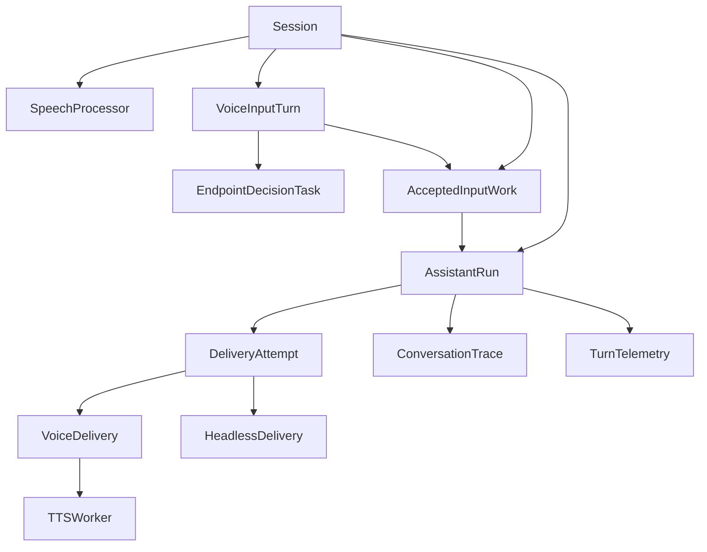

# Turn Lifecycle Cleanup

> **Partial** — Shipped: Phases 1–2, plus module-boundary reliability cleanup (`history.py` / `execution.py` / centralized trigger settlement) without introducing `AssistantRun`. Open: `AssistantRun`, visibility metadata ([ROADMAP](../../ROADMAP.md) Phase 9.6).

**Status:** Partially implemented (Phases 1-2 complete; reliability cleanup shipped under existing ownership boundaries; `AssistantRun` and visibility metadata deferred)
**Date:** 2026-05-03  
**Priority:** Medium. Structural cleanup to reduce future voice-turn race conditions after the targeted TTS cancellation fix.  
**Depends on:** The targeted TTS cancellation fix in `backend/core/turns/delivery.py`, `backend/core/voice/tts_service.py`, and `backend/api/websockets/connection.py`.

---

## Problem

The current turn system works, but the term "turn" now covers too many related lifecycles:

| Current concept | What it actually represents |
| --- | --- |
| Legacy voice-input state name | Now `VoiceInputTurn`: VAD/STT transcript, late continuation, endpoint metadata. |
| `accepted_input_task` | Voice-only post-commit handoff: final STT, local-command handling, and scheduling the assistant run. |
| `current_run_task` | The active assistant execution / delivery task. |
| `VoiceDelivery` | One output delivery attempt for a run. |
| `turn_trace` | Conversation rows produced by an agent run. |
| `turn_runs` | Operational telemetry keyed by `turn_id`. |
| `turn_id` | Correlation id shared across input, execution, delivery, persistence, and telemetry. |
| `protocol_runs` | Protocol execution lifecycle linked back to `turn_id`. |

That shared vocabulary blurred ownership boundaries. The fast-recovery freeze exposed the risk: session-level cancellation state (`tts_cancel`) was reused across independent assistant attempts, so Turn N+1 could mutate Turn N's cleanup path.

The immediate freeze fix moved TTS cancellation onto `VoiceDelivery`. This proposal is the later cleanup: make the lifecycle model explicit so future interruption, recovery, headless turn, and delivery changes do not reintroduce cross-turn races.

---

## Design Principle

Do not introduce a giant generic `Turn` abstraction.

The existing split is mostly right:

- `SpeechProcessor` owns audio state.
- `VoiceInputTurn` owns voice input state.
- `AssistantOrchestrator.process_turn()` owns execution lifecycle.
- `VoiceDelivery` / `HeadlessDelivery` own output behavior.
- `conversations` owns retained content.
- `turn_runs` owns telemetry.

The cleanup should tighten names and ownership, not add an orchestration framework.

---

## Target Vocabulary

Use these names in docs first, then code where the rename pays for itself.

| Name | Scope | Lifetime |
| --- | --- | --- |
| `VoiceInputTurn` | What the user said in one logical voice utterance. Owns VAD/STT/continuation state. | Starts on wake/speech start. Survives late continuation. Ends when merged input is accepted, dropped, or interrupted as a fresh turn. |
| `AcceptedInputWork` | The post-commit handoff window for accepted input before an assistant run is necessarily active. | Starts when endpointing commits. Covers final STT flush, local command handling, and scheduling the assistant run. |
| `AssistantRun` | One model/tool execution attempt for accepted input or system context. | Starts when `process_turn()` is scheduled. Ends on success, cancellation, or failure. |
| `DeliveryAttempt` | One attempt to deliver output to a channel. | Starts inside an `AssistantRun`; may be voice, text, headless, prefetched, etc. |
| `ConversationTrace` | Content retained for history/context. | Persisted after run completion or intentional interruption. |
| `TurnTelemetry` | Timings/counters/diagnostics. | Collected throughout input, execution, and delivery; persisted to `turn_runs`. |

`turn_id` remains the correlation key across all of these. The distinction is conceptual ownership, not separate user-visible ids.

---

## Cleanup State

### 1. Rename voice input state

The voice input state dataclass is now named `VoiceInputTurn`.

Files:

- `backend/api/websockets/connection.py`
- `backend/api/websockets/handlers.py`
- voice-turn tests under `backend/tests/`
- `docs/SYSTEM_STATES.md`
- `docs/ARCHITECTURE.md`

Keep the fields as-is initially:

```python
@dataclass
class VoiceInputTurn:
    turn_id: str
    last_endpoint_monotonic: float = 0.0
    transcript_text: str = ""
    continuation_prefix: str = ""
    endpoint_candidate_started_at: float = 0.0
    endpoint_candidate_text_chars: int = 0
```

This makes the intent clear: it is not an orchestrator turn and should not exist for text/system/headless work.

Acceptance:

- No behavior change.
- All docs refer to voice input state as `VoiceInputTurn`.
- Existing late-continuation tests still pass.

### 2. Split accepted input handoff from assistant run

`Session.current_turn_task` used to be overloaded:

- while an endpoint is being committed, it can point at `_resolve_endpoint_candidate()` so late continuation can cancel final STT/local-command handoff;
- after `_commit_voice_turn()` schedules `process_turn()`, it points at the active assistant execution attempt.

The cleanup split this before renaming:

| New name | Meaning |
| --- | --- |
| `accepted_input_task` | Post-commit voice handoff: final STT, local command handling, and scheduling. |
| `current_run_task` | Active `process_turn()` / assistant execution attempt. |

Files:

- `backend/api/websockets/connection.py`
- `backend/api/websockets/handlers.py`
- `backend/core/turns/orchestrator.py`
- tests under `backend/tests/`
- docs that describe session fields.

Acceptance:

- No semantic changes.
- Fast recovery can still cancel accepted-but-not-yet-responding work without clearing the `VoiceInputTurn`.
- Barge-in still creates a fresh `VoiceInputTurn`.
- No field named `current_run_task` points at endpoint finalization work.

### 3. Introduce a small `AssistantRun` record only when needed

Do not add this just for naming. Add it when another run-owned field appears on `Session`.

Current run-owned fields already include:

- `current_run_task` (after the split above)
- `current_delivery`

If these continue to grow, wrap them:

```python
@dataclass
class AssistantRun:
    turn_id: str
    task: asyncio.Task
    delivery: DeliveryAttempt | None = None
    response_id: str | None = None

    def cancel(self, reason: str) -> None:
        if self.delivery:
            self.delivery.signal_cancel()
        self.task.cancel(reason)
```

`Session` would then hold:

```python
current_run: AssistantRun | None = None
```

This is intentionally small. It is a lifetime owner, not a generic turn model.

Acceptance:

- No free-floating run-owned fields on `Session` once `AssistantRun` exists.
- Cancellation APIs target `AssistantRun`, not individual worker internals.
- `AssistantRun` deletes session-level run fields rather than wrapping them while leaving all mutation paths in place.
- `VoiceDelivery` still owns TTS worker details.

### 4. Keep cancellation scoped to the owner

Future rule: cancellation state must live on the object that owns the task being cancelled.

| Task / work | Owner | Cancellation surface |
| --- | --- | --- |
| Endpoint decision window | `Session.endpoint_decision_task` for now; future `VoiceInputTurn` candidate scope. | `_cancel_endpoint_decision()` |
| Accepted input handoff | `accepted_input_task` or documented `current_turn_task` dual role. | fast recovery: await handoff to capture STT; cancel `current_run_task` with reason; preserve `VoiceInputTurn`. Barge-in/disconnect may still cancel handoff. |
| Assistant execution | `AssistantRun` / `current_run_task` | `cancel_run(reason)` |
| Voice delivery / TTS worker | `VoiceDelivery` | `VoiceDelivery.signal_cancel()` + task cancellation in `aclose(cancelled=True)` |
| Streaming STT | `Session.stt_stream` (`StreamingSTTCoordinator`) for Cartesia and `apple_speech`. | `_close_streaming_stt(reason=...)` |

Do not reintroduce session-global cancellation events.

Acceptance:

- No session-level `asyncio.Event` for a child task.
- Every `asyncio.create_task()` has an explicit owning object and cleanup path.

### 5. Clarify turn axes in persistence and diagnostics

Standardize these meanings:

| Axis | Meaning | Examples |
| --- | --- | --- |
| `source` | Who initiated work. | `user`, `system` |
| `modality` | How input entered. | `voice`, `text`, `multimodal`, `system` |
| `channel` | Transport/output surface. Store only when it becomes useful. | `voice`, `text`, `headless` |
| `delivery` | System delivery policy/path. User turns may omit it. Conditional presentation is represented by `TriggerAction.decision="offer"`, not a delivery value. | `None`, `announce`, `silent`, `prefetched` |
| `origin` | Why system work happened. | `automation`, `system_pulse`, `scheduler`, `protocol` |
| `outcome` | What happened. | `completed`, `cancelled`, `interrupted`, `suppressed`, `failed` |
| `visibility` | Whether content enters user-visible history. | `user_visible`, `hidden` |

Do this gradually:

1. Keep the existing `delivery` strings for compatibility.
2. Add `visibility` only when filtering gets more complex.
3. Move `suppressed` from delivery to outcome only when there is a schema/version boundary.
4. Treat `automation` as `origin.type`, not a source.
5. Do not add `delivery="voice"` or `delivery="text"`; that belongs to `modality` or a future `channel`.

Acceptance:

- `source` remains `user | system` in new writes.
- UI/history filtering does not depend on ambiguous delivery strings once `visibility` exists.
- `turn_id` remains the invariant join key across `conversations`, `turn_runs`, and `protocol_runs`.

---

## Target Ownership Diagram



Key rule: child tasks cannot outlive the owner that created them.

---

## Implementation Plan

### Phase 1: Documentation and voice-input naming ✅ Implemented

1. Use `VoiceInputTurn` for voice input state.
2. Add a short "Turn Vocabulary" section to `docs/ARCHITECTURE.md` and `docs/SYSTEM_STATES.md`.
3. Document that `current_turn_task` currently has a dual role and must not be renamed to `current_run_task` until it is split.
4. Update docs and tests.

No behavior changes.

### Phase 2: Split accepted input handoff from assistant run ✅ Implemented

1. Split the post-commit endpoint handoff from the active `process_turn()` task.
2. Introduced `accepted_input_task` for final STT/local-command/scheduling work.
3. Renamed the active assistant execution handle to `current_run_task`.
4. Fast recovery semantics preserved: late continuation awaits `accepted_input_task` while handoff finalizes STT, then cancels `current_run_task` if the assistant run started, keeping `VoiceInputTurn` intact.
5. Barge-in/interruption cancels both `accepted_input_task` and `current_run_task`.
6. All trigger/protocol/prefetch scheduling assignments use `current_run_task`.
7. Disconnect cleanup cancels both with `"disconnect"` reason.

### Reliability cleanup (module boundaries) ✅ Implemented

Shipped without adding `AssistantRun`, a generic state machine, or schema changes:

1. Moved conversation-window projection/loading into `backend/core/turns/history.py`.
2. Moved the delivery-agnostic agent loop into `backend/core/turns/execution.py`.
3. Centralized post-execution trigger settlement on the orchestrator while keeping `TriggerService` transitions authoritative; split due-dispatch into named `act` / `offer` / `tell` paths.
4. Removed dead local coupling (`_last_responses`, unused datetime helper) and shared clock context via `build_turn_time_context()`.

### Phase 3: Run-owned state consolidation

If run-owned fields keep expanding:

1. Add a tiny `AssistantRun` dataclass.
2. Move `current_run_task` and `current_delivery` under it.
3. Add `cancel_current_run(reason: str)` on `Session` or the orchestrator boundary.

Keep `VoiceDelivery` as the delivery owner. Do not move TTS worker logic into `AssistantRun`.

### Phase 4: Visibility/outcome cleanup

When read-side filtering or diagnostics become painful:

1. Add `visibility` to conversation metadata.
2. Add `outcome` to telemetry and trace metadata.
3. Stop overloading delivery strings such as `suppressed`.
4. Backfill only if needed for UI/history correctness.

---

## Non-Goals

- No generic `Turn` superclass.
- No rewrite of `AssistantOrchestrator.process_turn()`.
- No requirement to move to `asyncio.TaskGroup` immediately.
- No change to the CodeAct loop.
- No change to the MongoDB `turn_id` correlation model.
- No schema migration unless Phase 4 lands.

---

## Tradeoffs

**Why not introduce `AssistantRun` immediately?**  
The targeted freeze fix already made cancellation delivery-scoped. Adding `AssistantRun` now would mostly wrap existing fields without removing much complexity. Wait until it can delete enough session fields and expose a real `cancel(reason)` boundary.

**Why not rename `current_turn_task` immediately?**  
Because it currently points at endpoint finalization work before `process_turn()` is scheduled. A `current_run_task` name would hide that important fast-recovery behavior. Split the lifetimes first.

**Why keep `turn_id` shared?**  
It is useful as the cross-cutting correlation key. The problem was not the id; the problem was using one word, "turn", for multiple lifetimes.

**Why add `visibility` later, not now?**  
Current filtering works. A new axis is helpful once hidden/system/headless variants grow, but adding it before callers need it would create metadata churn.

---

## Acceptance Criteria

- A new engineer can answer: "Is this voice input state, assistant execution state, delivery state, telemetry, or persisted content?"
- Late continuation preserves `VoiceInputTurn` but cancels only accepted input work or the active `AssistantRun`.
- Barge-in cancels the active run and starts fresh voice input.
- No session-global cancellation primitive controls a child task.
- `source`, `modality`, `channel`, `delivery`, `origin`, `outcome`, and `visibility` have one documented meaning each.
- No field named `current_run_task` points at endpoint finalization work.
- All existing voice lifecycle tests pass after each phase.
